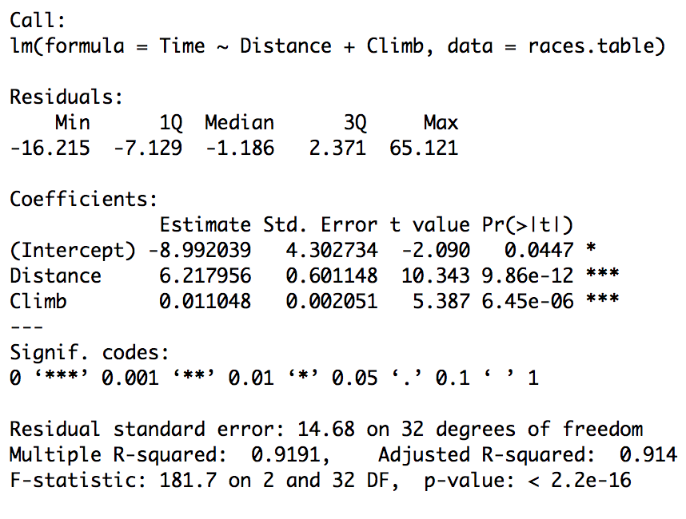

```{r setup, include=FALSE}
knitr::opts_chunk$set(echo = TRUE, fig.width = 7, fig.height = 4, message=FALSE, warning=FALSE, cache = TRUE)
set.seed(0)
library(ggplot2)
```


## Recap

- What is a regression model?
- Descriptive statistics -- graphical
- Descriptive statistics -- numerical
- Inference about a population mean
- Difference between two population means
- Some tips on R
- Simple linear regression (covariance, correlation, estimation, geometry of least squares)
    - Inference on simple linear regression model
    - Goodness of fit of regression: analysis of variance.
    - $F$-statistics.
    - Residuals.
    - Diagnostic plots for simple linear regression (graphical methods).

## Recap
- Multiple linear regression
    - Specifying the model.
    - Fitting the model: least squares.
    - Interpretation of the coefficients.
    - Matrix formulation of multiple linear regression
    - Inference for multiple linear regression
        - $T$-statistics revisited.
        - More $F$ statistics.
        - Tests involving more than one $\beta$.   

## Outline

- Diagnostics – more on graphical methods and numerical methods (**CH** Chapter 4.1-4.2, 4.4, 4.5, 4.6)
- Different types of residuals (**CH** Chapter 4.3)
- Diagnostics for assumptions on errors (**CH** Chapter 4.7)
- Influence (**CH** Chapter 4.9, 4.10)

    
## Data 
- Example: (The Socttish Hills Races Data), **CH**: Page 118.
- The data set we will use is based on record times on [\blc Scottish hill races\bc](http://www.statsci.org/data/general/hills.html).

\begin{table}
\begin{tabular}{|l|l|}
\hline
Variable &	Description\\ \hline
Time &	Record time to complete course (in seconds) \\ \hline
Distance &	Distance in the course (in miles)\\ \hline
Climb	& Vertical climb in the course (in feet)\\ \hline
\end{tabular}
\end{table}
- Time: response variable.
- Distance and Climb: predictor variables.
- 35 races in Scotland in 1984.

## Data
```{r}
url = 'http://www.statsci.org/data/general/hills.txt' 
races.table = read.table(url, 
  header=TRUE, sep='\t')
head(races.table)
```

## Exploratory analysis
- As we'd expect, the time increases both with `Distance` and `Climb`.
```{r echo=FALSE}
plot(races.table[,2:4], pch=23, bg='orange', cex=2)
```

Let's look at our multiple regression model.

## Multiple linear regression (MLR)
```{r}
races.lm = lm(Time ~ Distance + Climb, 
  data=races.table)
```

## 



- But is this a good model? 

# Diagnostics

## What can go wrong?

- Assumptions about the form of the model: 
    - Regression function can be wrong: maybe regression function should have some other form (see diagnostics for simple linear regression).
- Assumptions about the errors:
    - may not be normally distributed..
    - may not be independent (autocorrelation problem-**CH** Chapter 8).
    - may not have the same variance (heteroscedasticity- **CH** Chapter 7).
    - may not have the mean zero.
- Assumptions about the predictors:
    - may be nonrandom.
    - may be some measurement errors in predictors.
- Assumptions about the observations:
    - may be some observations are influential/outliers (Robust regression).
-   Detecting problems is more *art* than *science*, i.e. we cannot *test* for all possible problems in a regression model.

## Residual analysis

- Basic idea of diagnostic measures: if model is correct then residuals $e_i = Y_i -\widehat{Y}_i, 1 \leq i \leq n$ should look like a sample of (not quite independent) $N(0, \sigma^2)$ random variables.

## Standard diagnostic plots

- `R` produces a set of standard plots for `lm` that help us assess whether our assumptions are reasonable or not. 
    - We will go through each in some, but not too much, detail.

- As we see next, there are some quantities which we need to define in order to read these plots. We will define these first.

##
```{r fig.width = 7, fig.height = 5.5}
par(mfrow=c(2,2))
plot(races.lm, pch=23 ,bg='orange',cex=2)
```

## Possible problems & diagnostic checks

- Errors may not be normally distributed or may not have the same variance – `qqnorm` can help with this. 
    - This may not be too important in large samples.

-   Variance may not be constant. Can also be addressed in a plot of $X$ vs. $e$: *fan shape* or other trend indicate non-constant variance.

-   Influential observations. Which points “affect” the regression line the most?

-   Outliers: points where the model really does not fit! 
    - Possibly mistakes in data transcription, lab errors, who knows? Should be recognized and (hopefully) explained.
    
## Types of residuals
-   Ordinary residuals: $e_i = Y_i - \widehat{Y}_i$. These measure the
    deviation of predicted value from observed value, but their
    distribution depends on unknown scale, $\sigma$.

-   Internally studentized residuals (`rstandard` in R):
    $$r_i = e_i / SE(e_i) = \frac{e_i}{\widehat{\sigma} \sqrt{1 - H_{ii}}}$$
    
- Above, $H$ is the “hat” matrix $H=X(X^TX)^{-1}X^T$. 
- $r_i$'s are almost $t$-distributed, except $\widehat{\sigma}$ depends on $e_i$.
    
## Compare ordinary and studentized residuals
 
```{r}
plot(resid(races.lm), 
  rstudent(races.lm), pch=23, bg='blue', cex=3)
```

## Types of residuals

- Externally studentized residuals (`rstudent` in R):
    $$t_i = \frac{e_i}{\widehat{\sigma_{(i)}} \sqrt{1 - H_{ii}}} \sim t_{n-p-2}.$$
    - These are exactly $t$ distributed so we know their distribution and can use them for tests, if desired.
    
- The quantity $\hat{\sigma}^2_{(i)}$ is the mean squared error (MSE) of the model fit to all data except case $i$ (i.e. it has $n-1$ observations and $p$ predictors).

- Numerically, these residuals are highly correlated, as we would expect.

## Compare studentized and externally studentized residuals
```{r}
plot(rstandard(races.lm), 
  rstudent(races.lm), pch=23, bg='blue', cex=3)
```

# Standard diagnostic plots

## Quantile plot for the residuals
- The first plot is the quantile plot for the residuals, that compares their distribution to that of a sample of independent normal.

```{r fig.show='hide'}
qqnorm(rstandard(races.lm), pch=23, 
  bg='red', cex=2)
```

## Quantile plot for the residuals
```{r echo=FALSE}
qqnorm(rstandard(races.lm), pch=23, 
  bg='red', cex=2)
```

- If the residuals were really normal we'd expect this plot to be roughly on the diagonal.

##
- For example, if we have a sample from a standard normal distribution, the qq-plot looks like the following:
```{r}
qqnorm(rnorm(500), pch=23, 
  bg='red', cex=2)
abline(0, 1)
```

## Plots for addressing constant variance assumption
- Two other plots try address the constant variance assumptions.   - If these plots have a particular shape (maybe the spread increases with $\hat{Y}$) then maybe the variance is not constant.

## Plots for addressing constant variance assumption
```{r fig.show='hide'}
plot(fitted(races.lm), 
  sqrt(abs(rstandard(races.lm))), 
  pch=23, bg='red', ylim=c(0,1))
```

## Plots for addressing constant variance assumption
```{r echo=FALSE}
plot(fitted(races.lm), 
  sqrt(abs(rstandard(races.lm))), 
  pch=23, bg='red', ylim=c(0,1))
```

## Plots for addressing constant variance assumption
```{r fig.show='hide'}
plot(fitted(races.lm), 
  resid(races.lm), pch=23, bg='red', cex=2)
abline(h=0, lty=2)
```

## Plots for addressing constant variance assumption
```{r echo=FALSE}
plot(fitted(races.lm), 
  resid(races.lm), pch=23, bg='red', cex=2)
abline(h=0, lty=2)
```

## Influence of an observation

- Other plots provide an assessment of the `influence` of each observation.
- Usually, this is done by dropping an entire case $(y_i, x_i)$ from the data set and refitting the model.
- In this setting, a$\cdot_{(i)}$ indicates $i$-th observation was not used in fitting the model.
- For example: $\widehat{Y}_{j(i)}$ is the regression function evaluated at the $j$-th observation predictors BUT the coefficients $(\widehat{\beta}_{0(i)}, \dots, \widehat{\beta}_{p(i)})$ were fit after deleting $i$-th case from the data.

## Influence of an observation

- Idea: if $\widehat{Y}_{j(i)}$ is very different than $\widehat{Y}_j$ (using all the data) then $i$ is an influential point, at least for estimating the regression function at $(X_{1,j}, \dots, X_{p,j})$.
    
- Could also look at difference between $\widehat{Y}_{i(i)} - \widehat{Y}_i$, or any other measure.
    
- There are various standard measures of influence (DFFITS, Cook’s distance, DFBETAS for $X_{p}$). 

## DFFITS

-   $$DFFITS_i = \frac{\widehat{Y}_i - \widehat{Y}_{i(i)}}{\widehat{\sigma}_{(i)} \sqrt{H_{ii}}}$$
-   This quantity measures how much the regression function changes at the $i$-th case / observation when the $i$-th case / observation is deleted.
-   For small/medium data sets: value of 1 or greater is “suspicious”. For large data set: value of $2 \sqrt{(p+1)/n}$.
- `R` has its own standard rules similar to the above for marking an observation as influential.

## DFFITS plot
```{r fig.show='hide'}
plot(abs(dffits(races.lm)), pch=23, 
  bg='orange', cex=2, ylab="DFFITS")
```

##
```{r echo=FALSE}
plot(abs(dffits(races.lm)), pch=23, 
  bg='orange', cex=2, ylab="DFFITS")
```

- It seems that some observations had a high influence measured by $DFFITS$:

##
```{R}
races.table[which(abs(dffits(races.lm)) > 1),]
2*sqrt((2+1)/35)
races.table[which(abs(dffits(races.lm)) > 0.5),]
```

- It is perhaps not surprising that the longest course and the course with the most elevation gain seemed to have a strong effect on the fitted values. What about `Knock Hill`? We'll come back to this later.

## Cook’s distance

- Cook’s distance measures how much the entire regression function changes when the $i$-th case is deleted.
- $$D_i = \frac{\sum_{j=1}^n(\widehat{Y}_j - \widehat{Y}_{j(i)})^2}{(p+1) \, \widehat{\sigma}^2}$$
-   Should be comparable to $F_{p+1,n-p-1}$: if the $C_{i}$ values greater than the 50\% point of the F-distribution, then the $i$-th case is likely influential: investigate further.
- Again, `R` has its own rules similar to the above for marking an observation as influential.
- What to do after investigation? No easy answer.

## Example (Cook’s distance)
```{r}
plot(cooks.distance(races.lm), 
  pch=23, bg='orange', cex=2, 
  ylab="Cook's distance")
```

## Example (Cook’s distance)
```{r}
races.table[which(cooks.distance(races.lm) > 1),]
qf(.5, df1 = 3, df2 = 32)
races.table[which(cooks.distance(races.lm) > .8),]
races.table[which(cooks.distance(races.lm) > 0.1),]
```

- Again, the same 3 races. 

## Example (Cook’s distance)
- This is not surprising as both $DFFITS$ and Cook's distance measure changes in fitted values. The difference is that one measures the influence on one fitted value, while the other measures the influence on the entire vector of fitted values.


## DFBETAS

- This quantity measures how much the coefficients change when the $i$-th case is deleted.

- $$DFBETAS_{j(i)} = \frac{\widehat{\beta}_j - \widehat{\beta}_{j(i)}}{\sqrt{\widehat{\sigma}^2_{(i)} (X^TX)^{-1}_{jj}}}.$$

-   For small/medium data sets: absolute value of 1 or greater is
    “suspicious”. For large data set: absolute value of $2 /  \sqrt{n}$.


## DFBETAS for $X_{1}$
```{r}
plot(abs(dfbetas(races.lm)[,'Climb']), 
  pch=23, bg='orange', 
  cex=2, ylab="DFBETA (Climb)")

```

## DFBETAS for $X_{1}$
```{r}
races.table[which(abs(dfbetas(races.lm)[,'Climb']) > 1),]
races.table[which(abs(dfbetas(races.lm)[,'Climb']) > .4),]
```

## DFBETAS for $X_{2}$
```{r}
plot(abs(dfbetas(races.lm)[,'Distance']), 
  pch=23, bg='orange', cex=2, 
  ylab="DFBETA (Climb)")
```

## DFBETAS for $X_{2}$
```{r}
races.table[which(abs(dfbetas(races.lm)[,
  'Distance']) > 1),]
races.table[which(abs(dfbetas(races.lm)[,
  'Distance']) > .4),]
```


## Reference

- **CH**: Chapter 4.
- Lecture notes of  [\blc Jonathan Taylor \bc](http://statweb.stanford.edu/~jtaylo/).