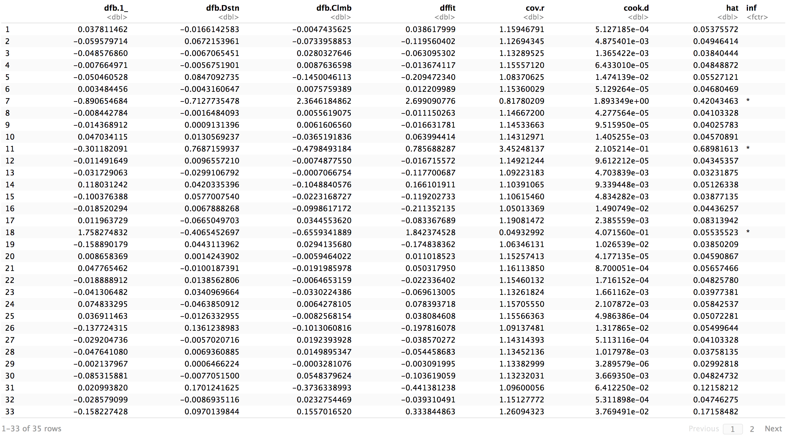
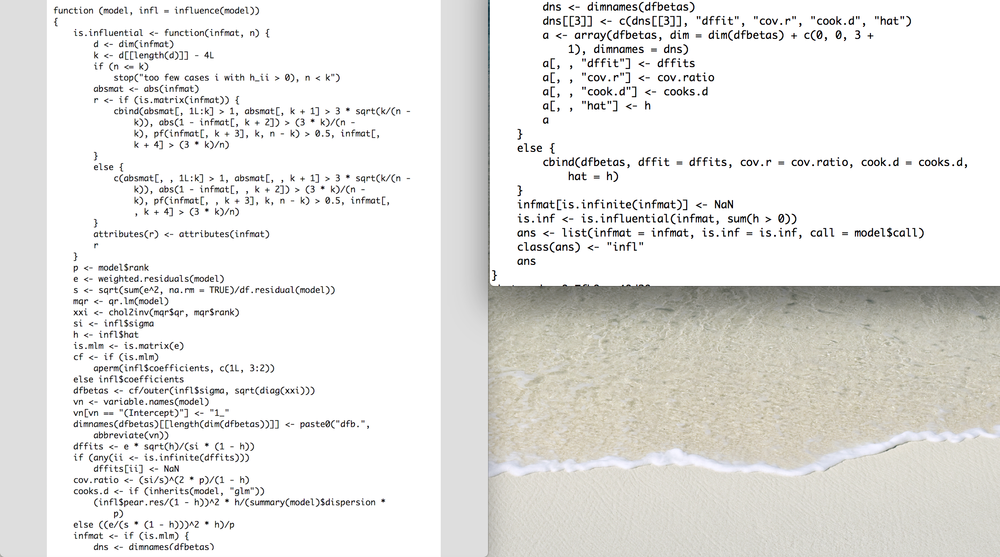

```{r setup, include=FALSE}
knitr::opts_chunk$set(echo = TRUE, fig.width = 7, fig.height = 4, message=FALSE, warning=FALSE, cache = TRUE)
set.seed(0)
library(ggplot2)
```


## Recap

- What is a regression model?
- Descriptive statistics -- graphical
- Descriptive statistics -- numerical
- Inference about a population mean
- Difference between two population means
- Some tips on R
- Simple linear regression (covariance, correlation, estimation, geometry of least squares)
    - Inference on simple linear regression model
    - Goodness of fit of regression: analysis of variance.
    - $F$-statistics.
    - Residuals.
    - Diagnostic plots for simple linear regression (graphical methods).

## Recap
- Multiple linear regression
    - Specifying the model.
    - Fitting the model: least squares.
    - Interpretation of the coefficients.
    - Matrix formulation of multiple linear regression
    - Inference for multiple linear regression
        - $T$-statistics revisited.
        - More $F$ statistics.
        - Tests involving more than one $\beta$.   
- Diagnostics – more on graphical methods and numerical methods (**CH** Chapter 4.1-4.2, 4.4, 4.5, 4.6)
    - Different types of residuals (**CH** Chapter 4.3)
    - Diagnostics for assumptions on errors (**CH** Chapter 4.7)
    - Influence (**CH** Chapter 4.9, 4.10)

## Outline
- Outlier detection (**CH** Chapter 4.8, 4.11, 4.14)
- Multiple comparison (Bonferroni correction)
- Residual plots: (**CH** Chapter 4.12, 4.13)
    - partial regression (added variable) plot,
    - partial residual (residual plus component) plot.
    

## Data
```{r}
url = 'http://www.statsci.org/data/general/hills.txt' 
races.table = read.table(url, 
  header=TRUE, sep='\t')
head(races.table)
```

```{r include=FALSE}
races.lm = lm(Time ~ Distance + Climb, 
  data=races.table)
```

# Diagnostics
  
## Outliers

- The essential definition of an *outlier* is an observation pair $(Y, X_1, \dots, X_p)$ that does not follow the model, while most other observations seem to follow the model.

- Outlier in *predictors*: the $X$ values of the observation may lie outside the “cloud” of other $X$ values. 
    - This means you may be extrapolating your model inappropriately. 
    - The values $H_{ii}$ can be used to measure how “outlying” the $X$ values are.

-   Outlier in *response*: the $Y$ value of the observation may lie very far from the fitted model. 
    - If the studentized residuals are large: observation may be an outlier.

## Outliers

- The races at `Bens of Jura` and `Lairig Ghru` seem to be outliers in *predictors* as they were the highest and longest races, respectively.

- How can we tell if the `Knock Hill` result is an outlier? 
    - It seems to have taken much longer than it should have so maybe it is an outlier in the *response*.
    
## Outlying $X$ values

- One way to detect outliers in the *predictors*, besides just looking at the actual values themselves, is through their leverage values, defined by
$$
\text{leverage}_i = H_{ii} = (X(X^TX)^{-1}X^T)_{ii}.
$$

- Not surprisingly, our longest and highest courses show up again. 
    - This at least reassures us that the leverage is capturing some of this "outlying in $X$ space".

## Outlying $X$ values
```{r}
plot(hatvalues(races.lm), pch=23, 
  bg='orange', cex=2, ylab='Hat values')
```

## Outlying $X$ values
```{r}
races.table[which(hatvalues(races.lm) > 0.3),]
```

## Outliers in the response

- We will consider a crude outlier test that tries to find residuals that are "larger" than they should be.

- Since `rstudent` are $t$ distributed, we could just compare them to the $T$ distribution and reject if their absolute value is too large.

- Doing this for every observation results in $n$ different hypothesis tests.

- This causes a problem: if $n$ is large, if we “threshold” at $t_{1-\alpha/2, n-p-2}$ we will get many outliers by chance even if model is correct. 

- In fact, we expect to see $n \cdot \alpha$ “outliers” by this test. Every large data set would have outliers in it, even if model was entirely correct!

## Outliers in the response
- Let's sample some data from our model to convince ourselves that this is a real problem.
```{r}
set.seed(1)
X = rnorm(100)
Y = 2 * X + 0.5 + rnorm(100)
alpha = 0.1
cutoff = qt(1 - alpha / 2, 97)
sum(abs(rstudent(lm(Y~X))) > cutoff)
```

## Outliers in the response
```{r}
# Bonferroni correction
# X = rnorm(100)
# Y = 2 * X + 0.5 + rnorm(100)
cutoff = qt(1 - (alpha / 100) / 2, 97)
sum(abs(rstudent(lm(Y~X))) > cutoff)
```

## Multiple comparisons

- This problem we identified is known as *multiple comparisons* or *simultaneous inference.* 

- When performing many tests (say $m$) each at level $\alpha$, we expect at least $\alpha m$ rejections even when *all* null hypotheses are true!

- In outlier detection, we are performing $m=n$ hypothesis tests, but might still like to control the probability of making *any* false positive errors.
    
- The reason we don't want to make errors here is that we don't
want to throw away data unnecessarily.

- One solution: Bonferroni correction, threshold at $t_{1 - \alpha/(2*n), n-p-2}$.

## Bonferroni correction

- Dividing $\alpha$ by $n$, the number of tests, is known as a *Bonferroni* correction.

- If we are doing many $t$ (or other) tests, say $m \gg 1$ we can control overall false positive rate at $\alpha$ by testing each one at level $\alpha/m$. 
  
- In this case $m=n$, but other times we might look at a different number of tests.

## Bonferroni correction

- Essentially the *union bound* for probability.

- **Proof:** when the model is correct, with studentized residuals $T_i$:
$$\begin{aligned}
        P\left( \text{at least one false positive} \right)
        &  = P \left(\cup_{i=1}^m |T_i| \geq t_{1 - \alpha/(2*m), n-p-2} \right) \\
        & \leq \sum_{i=1}^m P \left( |T_i| \geq t_{1 - \alpha/(2*m), n-p-2} \right) \\
        &  = \sum_{i=1}^m  \frac{\alpha}{m} = \alpha. \\
       \end{aligned}$$

- Let's apply this to our data. It turns out that `KnockHill` is a [known error](http://www.statsci.org/data/general/hills.html).

## Example (Bonferroni correction)
```{r}
n = nrow(races.table)
cutoff = qt(1 - 0.05 / (2*n), 
  (n - 4))
races.table[which(abs(rstudent(races.lm)) > cutoff),]
```

## Example (Bonferroni correction)
- The package `car` has a built in function to do this test.
```{r}
library(car)
outlierTest(races.lm)
```

## Influential observation - leverage

- The last plot that `R` produces is a plot of residuals against leverage. 
- Points that have high leverage and large residuals are particularly influential.

##  Example (leverage versus residuals)
```{r}
plot(hatvalues(races.lm), rstandard(races.lm), 
  pch=23, bg='red', cex=2)
```


## Example (leverage versus residuals)

- `R` will put the IDs of cases that seem to be influential in these (and other plots). 
    - Not surprisingly, we see our usual three suspects.

```{r}
plot(races.lm, which=5)
```

## Influence measures

- As mentioned above, `R` has its own rules for flagging points as being influential. 
- To see a summary of these, one can use the `influence.measures` function.

## Influence measures (in R)
```{r out.width = "300px"}
#influence.measures(races.lm)

```

## Influence measures (in R)
- While not specified in the documentation, the meaning of the asterisks can be found by reading the code. 
- The function `is.influential` makes the decisions to flag cases as influential or not. 
- We see that the `DFBETAS` are thresholded at 1.
- We see that `DFFITS` is thresholded at $3 * sqrt((p+1)/(n-p-1))$.
- Etc. 

## influence.measures() code

```{r results='hide'}
influence.measures
```


## Problems in the regression function

- True regression function may have higher-order non-linear terms, polynomial or otherwise.

- We may be missing terms involving more than one ${X}_{(\cdot)}$, i.e. ${X}_i \cdot {X}_j$ (called an *interaction*).

-  Some simple plots: *added-variable* and *component plus residual* plots can help to find nonlinear functions of *one variable*.
    
- We will find these plots of somewhat limited use in practice, but we will go over them as possibly useful diagnostic tools.

## Added variable plots

- Enable to see the magnitude f the regression coefficient of the new variable that is being considered for inclusion. 
- Can also identify influential observations.
- The functions can  be found in the `car` package.
- Procedure:
    - Let $\tilde{e}_{X_j,i}, 1\leq i \leq n$ be the residuals after regressing $X_j$ onto all columns of $X$ except $X_j$;
    - Let $e_{X_j,i}$ be the residuals after regressing ${Y}$ onto all columns of ${X}$ except ${X}_j$;
    - Plot $\tilde{e}_{X_j}$ against $e_{X_j}$.
    - If the (partial regression) relationship is linear this plot should look linear.

## Example (Added variable plots)
```{r}
avPlots(races.lm, 'Distance')
```

## Example (Added variable plots)
```{r}
avPlots(races.lm, 'Climb')
```

##  Residual + component plots
- Similar to added variable, but may be more helpful in identifying nonlinear relationships (horizontal axis is variable itself).
- Procedure: plot $X_{ij}, 1 \leq i \leq n$ vs.
    $e_i + \widehat{\beta}_j \cdot X_{ij} , 1 \leq i \leq n$.
- The violet line is a non-parametric smooth of the scatter plot that may suggest relationships other than linear.

## Example (Residual + component plots)

```{r}
crPlots(races.lm, 'Distance')
```

## Example (Residual + component plots)
```{r}
crPlots(races.lm, 'Climb')
```

## Reference

- **CH**: Chapter 4.
- Lecture notes of  [\blc Jonathan Taylor \bc](http://statweb.stanford.edu/~jtaylo/).