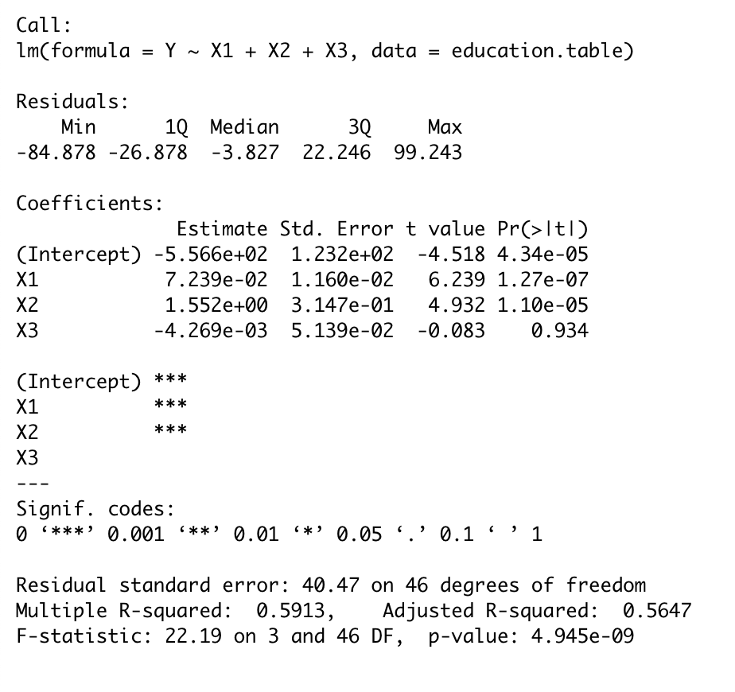
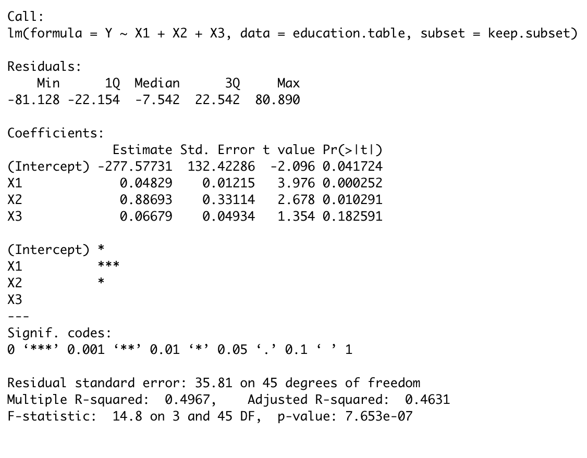
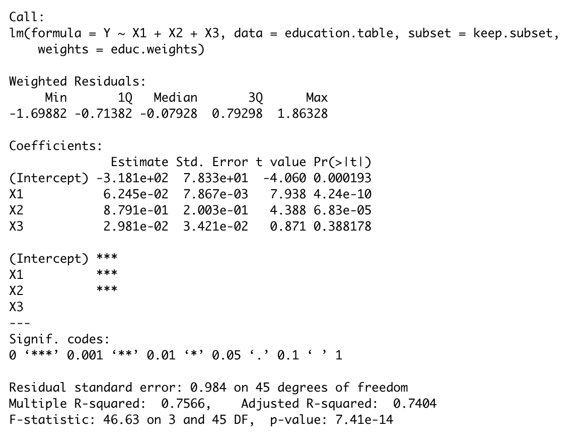

```{r setup, include=FALSE}
knitr::opts_chunk$set(echo = TRUE, fig.width = 7, fig.height = 4, message=FALSE, warning=FALSE, cache = TRUE)
set.seed(0)
library(ggplot2)
library(magrittr)
library(dplyr)
```


## Recap

- What is a regression model?
- Descriptive statistics -- graphical
- Descriptive statistics -- numerical
- Inference about a population mean
- Difference between two population means
- Some tips on R
- Simple linear regression (covariance, correlation, estimation, geometry of least squares)
    - Inference on simple linear regression model
    - Goodness of fit of regression: analysis of variance.
    - $F$-statistics.
    - Residuals.
    - Diagnostic plots for simple linear regression (graphical methods).

## Recap
- Multiple linear regression
    - Specifying the model.
    - Fitting the model: least squares.
    - Interpretation of the coefficients.
    - Matrix formulation of multiple linear regression
    - Inference for multiple linear regression
        - $T$-statistics revisited.
        - More $F$ statistics.
        - Tests involving more than one $\beta$.   
- Diagnostics – more on graphical methods and numerical methods
    - Different types of residuals
    - Influence
    - Outlier detection
    - Multiple comparison (Bonferroni correction)
    - Residual plots:
        - partial regression (added variable) plot,
        - partial residual (residual plus component) plot.

## Recap
- Adding qualitative predictors 
    - Qualitative variables as predictors to the regression model.
    - Adding interactions to the linear regression model. 
    - Testing for equality of regression relationship in various subsets of a population
- ANOVA
    - All qualitative predictors.
    - One-way layout
    - Two-way layout

# Transformation

## Outline

- We have been working with *linear* regression models so far in the course.

- Some models are nonlinear, but can be *transformed* to a linear model (**CH** Chapter 6).
    
- We will also see that transformations can sometimes *stabilize* the variance making constant variance a more reasonable assumption (**CH** Chapter 6).

- Finally, we will see how to correct for unequal variance using a technique weighted least squares (WLS) (**CH** Chapter 7).

## Bacterial colony decay (**CH** Chapter 6.3, Page 167)

- Here is a simple dataset showing the number of bacteria alive in a colony, $n_t$ as a function of time $t$. 
- A simple linear regression model is clearly not a very
good fit.

```{r}
bacteria.table = read.table('http://stats191.stanford.edu/data/bacteria.table', 
  header=T)
head(bacteria.table)
```


## Fitting (Bacterial colony decay)
```{r echo=FALSE}
p = ggplot(data = bacteria.table, 
  aes(x = t, y = N_t)) + 
  geom_point(shape =23, size = 2, 
    color = "orange", fill = "orange")
bacteria.lm = lm(N_t ~ t, bacteria.table)
p + geom_abline(intercept = bacteria.lm$coef[1], 
  slope = bacteria.lm$coef[2], col = "red")

```

## Diagnostics (Bacterial colony decay)
```{r echo=FALSE}
par(mfrow=c(2,2))
plot(bacteria.lm, pch=23, bg='orange')
```

## Exponential decay model

- Suppose the expected number of cells grows like $$E(n_t) = n_0 e^{\beta_1t}, \qquad t=1, 2, 3, \dots$$

- If we take logs of both sides $$\log E(n_t) = \log n_0 + \beta_1 t.$$

- A reasonable (?) model:
    $$\log n_t = \log n_0 + \beta_1 t + \varepsilon_t, \qquad \varepsilon_t \overset{IID}{\sim} N(0,\sigma^2).$$

##

```{r}
bacteria.log.lm = lm(log(N_t) ~ t, bacteria.table)
df = cbind(bacteria.table, 
  lm.fit = fitted(bacteria.lm), 
  lm.log.fit = exp(fitted(bacteria.log.lm)))
p = p + 
  geom_abline(intercept = bacteria.lm$coef[1], 
  slope = bacteria.lm$coef[2], 
    col = "red") +
  geom_line(data = df, 
    aes(x = t, y = lm.log.fit), 
    color = "green")

```

##
```{r echo=FALSE}
p
```

## Diagnostics 
```{r}
par(mfrow=c(2,2))
plot(bacteria.log.lm, pch=23, bg='orange')
```

## Logarithmic transformation

- This model is slightly different than original model:
    $$E(\log n_t) \leq \log E(n_t)$$ but may be approximately true.

- If $\varepsilon_t \sim N(0,\sigma^2)$ then
    $$n_t = n_0 \cdot \gamma_t \cdot e^{\beta_1 t}.$$

- $\gamma_t=e^{\varepsilon_t}$ is called a log-normal 
    $(0,\sigma^2)$ random variable.

## Linearizing regression function

- We see that an exponential growth or decay model can be made (approximately) linear. 
- Here are a few other models that can be linearized:
    - $y=\alpha x^{\beta}$, use $\tilde{y}=\log(y), \tilde{x}=\log(x)$;
    - $y=\alpha e^{\beta x}$, use $\tilde{y}=\log(y)$;
    - $y=x/(\alpha x - \beta)$, use $\tilde{y}=1/y, \tilde{x}=1/x$.
    - More in textbook.

## Caveats

- Just because expected value linearizes, doesn’t mean that the errors behave correctly.

- In some cases, this can be corrected using weighted least squares (more later).

- Constant variance, normality assumptions should still be checked.

## Stabilizing variance

- Sometimes, a transformation can turn non-constant variance errors to "close to" constant variance. This is another situation in which we might consider a transformation.
- Example: by the "delta rule", if
    $$\text{Var}(Y) = \sigma^2 E(Y)$$ then
    $$\text{Var}(\sqrt{Y}) \simeq \frac{\sigma^2}{4}.$$
    
- In practice, we might not know which transformation is best. [\blc Box-Cox transformations\bc](http://en.wikipedia.org/wiki/Power_transform) offer a tool to find a "best" transformation.

## Delta rule

The following approximation is ubiquitous in statistics.

- Taylor series expansion:
    $$f(Y) = f(E(Y)) + \dot{f}(E(Y)) (Y - E(Y)) + \dots$$

- Taking expectations of both sides yields:
    $$\text{Var}(f(Y)) \simeq \dot{f}(E(Y))^2  \cdot \text{Var}(Y)$$

## Delta rule

- So, for our previous example:
    $$\text{Var}(\sqrt{Y}) \simeq \frac{\text{Var}(Y)}{4 \cdot E(Y)}$$
    
- Another example
    $$\text{Var}(\log(Y)) \simeq \frac{\text{Var}(Y)}{E(Y)^2}.$$

## Caveats

- Just because a transformation makes variance constant doesn’t mean regression function is still linear (or even that it was linear)!

- The models are approximations, and once a model is selected our standard diagnostics should be used to assess adequacy of fit.

- It is possible to have non-constant variance but the variance stabilizing transformation may destroy linearity of the regression function. 
    - *Solution:* try weighted least squares (WLS).

# Weighted Least Squares (**CH** Chapter 7)

## Correcting for unequal variance: weighted least squares

- We will now see an example in which there seems to be strong evidence for variance that changes based on `Region`.

- After observing this, we will create a new model that
attempts to *correct* for this and come up with better estimates.

- *Correcting* for unequal variance, as we describe it here, generally requires a model for how the variance depends on observable quantities.

## Correcting for unequal variance: weighted least squares (**CH** Chapter 7.4, Page 197)

\begin{tabular}{|l|l|}
\hline
\textbf{Variable} &	\textbf{Description}\\
\hline
$Y$	& Per capita education expenditure by state\\
$X_{1}$ &	Per capita income in 1973 by state\\
$X_{2}$ & Proportion of population under 18\\
$X_{3}$  & Proportion in urban areas\\
Region & 	Which region of the country are the states located in\\
\hline
\end{tabular}

## lm
```{r}
education.table = read.table('http://stats191.stanford.edu/data/education1975.table', header=T)
education.table$Region = factor(education.table$Region)
education.lm = lm(Y ~ X1 + X2 + X3, data=education.table)

```

## lm
```{r eval=FALSE}
summary(education.lm)
```

```{r echo=FALSE,out.width = "200px"}

```


## Diagnostics
```{r}
par(mfrow=c(2,2))
plot(education.lm)
```

## Diagnostics
- there is an outlier, let's drop the outlier and refit

```{r}
boxplot(rstandard(education.lm) ~ education.table$Region,
  col=c('red', 'green', 'blue', 'yellow'))

```

## Fit a model without the outlier
```{r}
keep.subset = (education.table$STATE != 'AK')
education.noAK.lm = lm(Y ~ X1 + X2 + X3, 
  subset=keep.subset, 
  data=education.table)
```

## Fit a model without the outlier
```{r eval=FALSE}
summary(education.noAK.lm)
```

```{r echo=FALSE,out.width = "200px"}

```


##
```{r}
par(mfrow=c(2,2))
plot(education.noAK.lm)
```

## Diagnostics (refitted model)
```{R}
par(mfrow=c(1,1))
boxplot(rstandard(education.noAK.lm) ~ education.table$Region[keep.subset], 
  col=c('red', 'green', 'blue', 'yellow'))

```

## Re-weighting observations

- If you have a reasonable guess of variance as a function of the predictors, you can use this to *re-weight* the data.

- Hypothetical example
    $$Y_i = \beta_0 + \beta_1 X_i + \varepsilon_i, \qquad \varepsilon_i \sim N(0,\sigma^2 X_i^2).$$

- Setting $\tilde{Y}_i = Y_i / X_i$, $\tilde{X}_i = 1 / X_i$, model becomes $$\tilde{Y}_i = \beta_0 \tilde{X}_i + \beta_1 + \gamma_i, \gamma_i \sim N(0,\sigma^2).$$

## Weighted Least Squares

- Fitting this model is equivalent to minimizing $$\sum_{i=1}^n \frac{1}{X_i^2} \left(Y_i - \beta_0 - \beta_1 X_i\right)^2$$

- Weighted Least Squares
    $$SSE(\beta, w) = \sum_{i=1}^n w_i \left(Y_i - \beta_0 - \beta_1 X_i\right)^2, \qquad w_i = \frac{1}{X_i^2}.$$

- In general, weights should be like:
    $$w_i = \frac{1}{\text{Var}(\varepsilon_i)}.$$
    
- Our education expenditure example assumes
    $$
    w_i = W_{\tt Region[i]}
    $$

## Common weighting schemes

- If you have a qualitative variable, then it is easy to estimate weight within groups (our example today).

- "Often" $$\text{Var}(\varepsilon_i) = \text{Var}(Y_i) = V(E(Y_i))$$

- Many non-Gaussian (non-Normal) models behave like this: logistic, Poisson regression.

## What if we didn't re-weight?

- Our (ordinary) least squares estimator  with design matrix $X$ is
$$
\hat{\beta} =\hat{\beta}_{OLS} =  (X^TX)^{-1}X^TY = \beta + (X^TX)^{-1}X^T\epsilon.
$$

- Our model says that $\varepsilon | X \sim N(0, \sigma^2X)$ so
$$
\begin{aligned}
E[(X^TX)^{-1}X^T\epsilon] &= E[(X^TX)^{-1}X^T\epsilon|X] \\
&= 0
\end{aligned}
$$

So the **OLS estimator is unbiased.**

- Variance of $\hat{\beta}_{OLS}$ is
$$\text{Var}((X^TX)^{-1}X^T\epsilon) = \sigma^2 (X^TX)^{-1}X^TVX (X^TX)^{-1},$$ where $V =\text{diag}(X_1^2, \dots, X_n^2).$


## Two-stage procedure

- Suppose we have a hypothesis about the weights, i.e. they are constant within Region, or they are something like $$w_i^{-1} = \text{Var}(\epsilon_i) =  \alpha_0 + \alpha_1 X_{i1}^2.$$

- We pre-whiten: 
    1.  Fit model using OLS (Ordinary Least Squares) to get initial estimate $\widehat{\beta}_{OLS}$
    2.  Use predicted values from this model to estimate $w_i$.
    3.  Refit model using WLS (Weighted Least Squares).
    4.  If needed, iterate previous two steps.

## Example (two-stage procedure)
- Let's use $w_i^{-1} = \text{Var}(\epsilon_i)$.
```{r}
# Weight vector for each observation
educ.weights = 0 * education.table$Y
for (region in levels(education.table$Region)) {
  # remove the outlier Alaska
  subset.region = (education.table$Region[
    keep.subset] == region) 
  
  educ.weights[subset.region] = 1.0/(sum(resid(
    education.noAK.lm)[
    subset.region]^2) /sum(subset.region))
}
```

## Example (two-stage procedure)
- Weights for the observations in each `Region`
```{r}
unique(educ.weights)
```

## Weighted least squares regression
- Here is our new model. 
    - Note that the scale of the estimates is *unchanged*.
    - Numerically the estimates are similar. 
    - What changes most is the `Std. Error` column.

```{r}
education.noAK.weight.lm =lm(Y ~ X1 + X2 + X3, 
                               weights=educ.weights, 
                               subset=keep.subset, 
                               data=education.table)
```

## Weighted least squares regression
```{r eval=FALSE}
summary(education.noAK.weight.lm)
```

```{r echo=FALSE,out.width = "200px"}

```


## Diagnostics
```{r}
par(mfrow=c(2,2))
plot(education.noAK.weight.lm)
```


## Diagnostics
- Let's look at the boxplot again. It looks better, but perhaps not perfect.

```{r fig.show='hide'}
par(mfrow=c(1,1))
boxplot(resid(education.noAK.weight.lm, 
              type='pearson') ~
          education.table$Region[keep.subset], 
        col=c('red', 'green', 'blue', 'yellow'))
```

## Diagnostics
```{r echo=FALSE}
par(mfrow=c(1,1))
boxplot(resid(education.noAK.weight.lm, 
              type='pearson') ~
          education.table$Region[keep.subset], 
        col=c('red', 'green', 'blue', 'yellow'))
```


## Unequal variance: effects on inference

- So far, we have just mentioned that things *may* have unequal variance, but not thought about how it affects inference.

- In general, if we ignore unequal variance, our estimates of variance are not very good. The covariance has the “sandwich form” we saw above $$\text{Cov}(\widehat{\beta}_{OLS}) = (X'X)^{-1}(X'W^{-1}X)(X'X)^{-1}.$$
    with $W=\text{diag}(1/\sigma^2_i)$.
    
- ** If our `Std. Error` is incorrect, so are our conclusions based on $t$-statistics!**

- In the education expenditure data example, correcting for weights seemed to make the $t$-statistics larger. ** This will not always be the case!**

## Unequal variance: effects on inference

- Weighted least squares estimator
$$
\hat{\beta}_{WLS} = (X^TWX)^{-1}X^TWY
$$

- If we have the correct weights, then
$$
\text{Cov}(\widehat{\beta}_{WLS}) = (X^TWX)^{-1}.
$$

## Efficiency

- The efficiency of an unbiased estimator of $\beta$ is 1 / variance.

- Estimators can be compared by their efficiency: the more efficient, the better.

- The other reason to correct for unequal variance (besides so that we get valid inference) is for efficiency.

## Illustrative example

- Suppose
    $$Z_i = \mu + \varepsilon_i, \qquad \varepsilon_i \sim N(0, i^2 \cdot \sigma^2), 1 \leq i \leq n.$$

- Three **unbiased** estimators of $\mu$: $$\begin{aligned}
       \widehat{\mu}_1 &= \frac{1}{n}\sum_{i=1}^n Z_i \\
       \widehat{\mu}_2 &= \frac{1}{\sum_{i=1}^n i^{-2}}\sum_{i=1}^n i^{-2}Z_i \\
       \widehat{\mu}_3 &= \frac{1}{\sum_{i=1}^n i^{-1}}\sum_{i=1}^n i^{-1}Z_i \\
       \end{aligned}$$
       
       
## Illustrative example

- The estimator $\widehat{\mu}_2$ will always have lower variance, hence tighter confidence intervals. 
    
- The estimator $\widehat{\mu}_3$ has incorrect weights, but they are "closer" to correct than the naive mean's weights which assume each observation has equal variance.

## Illustrative example
```{r}
ntrial = 1000   # how many trials will we be doing?
nsample = 20   # how many points in each trial
sd = c(1:20)   # how does the variance change
mu = 2.0

get.sample = function() {
  return(rnorm(nsample)*sd + mu)
}

unweighted.estimate = numeric(ntrial)
weighted.estimate = numeric(ntrial)
suboptimal.estimate = numeric(ntrial)
```


## Illustrative example
- Let's simulate a number of experiments and compare the three estimates.

```{r}
for (i in 1:ntrial) {
  cur.sample = get.sample()
  unweighted.estimate[i] = mean(cur.sample)
  weighted.estimate[i] = sum(cur.sample/sd^2) / sum(1/sd^2)
  suboptimal.estimate[i] = sum(cur.sample/sd) / sum(1/sd)
}
```

## Illustrative example
- Compute $\text{SE}\left(\hat{\mu}_{i} \right)$
```{r}
data.frame(mean(unweighted.estimate),
           sd(unweighted.estimate))
data.frame(mean(weighted.estimate),
           sd(weighted.estimate))
data.frame(mean(suboptimal.estimate),
           sd(suboptimal.estimate))
```


## Illustrative example
```{r include=FALSE}
densY = c(density(unweighted.estimate)$y,
          density(weighted.estimate)$y,
          density(suboptimal.estimate)$y)
densX = c(density(unweighted.estimate)$x,
          density(weighted.estimate)$x,
          density(suboptimal.estimate)$x)
options(repr.plot.width=5, repr.plot.height=5)
```

```{r echo=FALSE}
plot(densX, densY, type='n', 
     main='Comparison of sampling distribution of the estimators', cex=0.8, xlim=c(-4, 8))
lines(density(weighted.estimate), 
      col='red', lwd=4)
lines(density(unweighted.estimate), 
      col='blue', lwd=4)
lines(density(suboptimal.estimate),
      col='purple', lwd=4)
legend(4,0.3, c('optimal', 
                'suboptimal', 'mean'), col=c('red', 'purple', 'blue'), 
       lwd=rep(4,3), cex=0.8)
```

## Reference

- **CH** Chapter 6 and Chapter 7
- Lecture notes of  [\blc Jonathan Taylor \bc](http://statweb.stanford.edu/~jtaylo/).