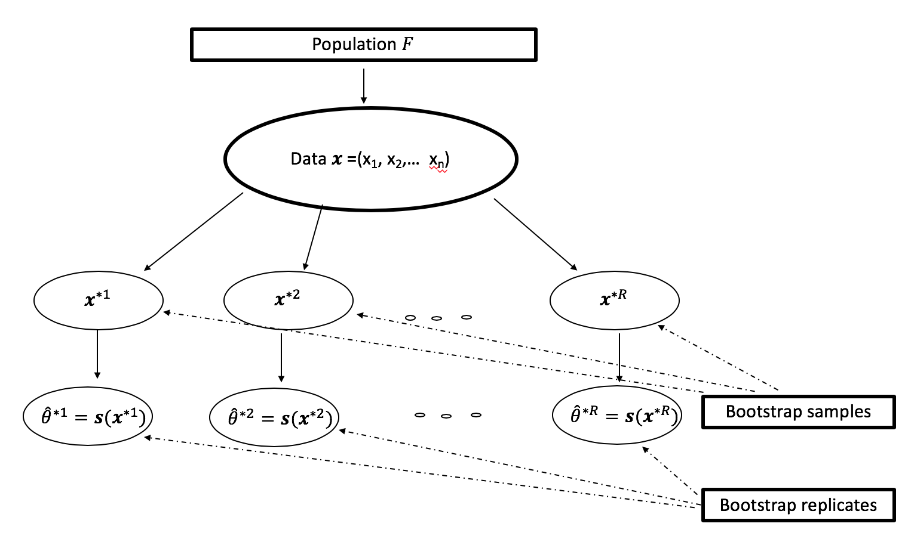

```{r setup, include=FALSE}
knitr::opts_chunk$set(echo = TRUE, fig.width = 7, fig.height = 4, message=FALSE, warning=FALSE, cache = TRUE)
set.seed(0)
library(ggplot2)
library(magrittr)
library(dplyr)
library(bootstrap)# For the book An Introduction to the Bootstrap (Efron and Tibshirani (1993))
library(boot)
library(car)
```


## Recap

- What is a regression model?
- Descriptive statistics -- graphical
- Descriptive statistics -- numerical
- Inference about a population mean
- Difference between two population means
- Some tips on R
- Simple linear regression (covariance, correlation, estimation, geometry of least squares)
    - Inference on simple linear regression model
    - Goodness of fit of regression: analysis of variance.
    - $F$-statistics.
    - Residuals.
    - Diagnostic plots for simple linear regression (graphical methods).

## Recap
- Multiple linear regression
    - Specifying the model.
    - Fitting the model: least squares.
    - Interpretation of the coefficients.
    - Matrix formulation of multiple linear regression
    - Inference for multiple linear regression
        - $T$-statistics revisited.
        - More $F$ statistics.
        - Tests involving more than one $\beta$.   
- Diagnostics – more on graphical methods and numerical methods
    - Different types of residuals
    - Influence
    - Outlier detection
    - Multiple comparison (Bonferroni correction)
    - Residual plots:
        - partial regression (added variable) plot,
        - partial residual (residual plus component) plot.

## Recap
- Adding qualitative predictors 
    - Qualitative variables as predictors to the regression model.
    - Adding interactions to the linear regression model. 
    - Testing for equality of regression relationship in various subsets of a population
- ANOVA
    - All qualitative predictors.
    - One-way layout
    - Two-way layout
- Transformation
    - Achieving linearity
    - Stabilize variance
    - Weighted least squares
- Correlated Errors
    - Generalized least squares


#  Bootstrapping linear regression

## Outline
- Bootstrap method [@efron1979] 
    - Recommended reading: [@davison1997], [@efron1994]
- Bootstrapping regression
- Motivation:
    - We've talked about correcting our regression estimator in two contexts: WLS (weighted least squares) and GLS (Generalized least squares).
    - Both require a model of the errors for the correction.
    - In both cases, we use a two stage procedure to "whiten" the data and use the OLS model on the "whitened" data.
    - **What if we don't have a model for the errors?**
    - We will use the [\blc bootstrap\bc](https://en.wikipedia.org/wiki/Bootstrapping_(statistics))


## The bootstrap

- Computer-based resampling procedure to access the statistical accuracy.
- Computes standard error or bias of a statistic or sampling distribution of a statistic or confidence intervals of parameters.
- No need a mathematical expression for the statistical accuracy such as bias or standard error.


## The bootstrap

- $\vX = \left(X_{1}, \cdots, X_{n}\right)^{T} \sim F$.
- $\theta = T(F)$, a parameter of interest.
- $\hat{\theta} = T(\hat{F}_{n})=s\left(\vx\right)$, an estimate from $\vx = \left(x_{1}, \cdots, x_{n}\right)^{T}$.
- Let $\hat{F}$ be the empirical distribution of the observed values $x_{i}$, $\hat{F}_{n}\left(t\right) = \dfrac{\sum_{i=1}^{n}I\left(x_{i} \leq t\right)}{n}$.
- A bootstrap sample $\vX^{*} = \left(X_{1}^{*},\cdots, X_{n}^{*} \right)$, a random sample of size $n$ drawn with replacement from $\hat{F}_{n}$ (total of distinct bootstrap samples ${2n-1 \choose n-1}$) [\blc see this link for the illustration\bc](http://statweb.stanford.edu/~susan/courses/s208/node37.html). 
- A bootstrap replication of $\hat{\theta}$ is $\hat{\theta}^{*} = s\left(\vx^{*}\right)$.
- Bootstrap replicates $\hat{\theta}^{*1}, \cdots, \hat{\theta}^{*R}$, where $R$ is the number of bootstrap samples.

## The bootstrap (illustration)



## The bootstrap method for estimating standard error

- Draw $R$ bootstrap samples $\vX^{*1}, \cdots, \vX^{*R}$ each with $n$ values with replacement.
- Evaluate bootstrap replicate $\hat{\theta}^{*r} = s\left(\vx^{*r} \right)$.
- Estimate the standard error $\text{se}\left(\hat{\theta}\right)$
$$\hat{\text{se}}_{\text{boot}}\left(\hat{\theta}\right) = \left[  \dfrac{\sum_{r=1}^{R}\left(\hat{\theta}^{*r} - \hat{\theta}^{*}(\cdot)\right)^{2}}{R-1}\right] ^{1/2},$$

where $\hat{\theta}^{*}(\cdot) = \dfrac{\sum_{r=1}^{R} \hat{\theta}^{*r}}{R}$.

- How large should be R? The rules of thumb: $R =50$ is often enough to give a good estimate of $\text{se}\left(\hat{\theta}\right)$ (much larger values of $R$ are required for confidence intervals).

##  Bootstrap percentile confidence interval

- Order bootstrap replicates $\hat{\theta}^{*}_{(1)}, \cdots, \hat{\theta}^{*}_{(R)}$.
- Let $m = \left[\alpha/2 \times R \right]$, $\left[u \right]$ is the largest integer less than or equal to $u$.
- Approximate $\left(1- \alpha\right)100\%$ confidence interval for
$\theta$ is $\left(\hat{\theta}^{*}_{(m)}, \hat{\theta}^{*}_{(R-m)}\right)$.
- Choose $R = 1000$ or larger than 1000.  

## Assessing the error in bootstrap estimates

- Bootstrap estimates are not exact (nearly unbiased but can have substantial variance).
- Two sources of variability
    - Sampling variability: we have only a sample of size $n$ rather than the entire population.
    - Bootstrap resampling variability: we only take $R$ bootstrap samples rather than total of ${2n-1 \choose n-1}$ distinct bootstrap samples.

## Two sources of variability (illustration)


## Example 
- An example from `bootstrap` package [@efron1994].
- The data are LSAT scores (for entrance to law school) and GPA. This data were used to illustrate the bootstrap by Bradly Efron, the inventor of the bootstrap. 

```{r}
data(law) # in the bootstrap package
head(law)
```

## Example (scatterplot)

```{r fig.show='hide'}
library(ggplot2)
ggplot(data = law, aes(x= LSAT, y= GPA))
```

## Example (scatterplot)

```{r echo=FALSE}
ggplot(data= law, aes(x= LSAT, y= GPA)) +
  geom_point() +
  geom_text(aes(label=rownames(law)),
            hjust=0, vjust=0)
```

## Example (Plug-in estimate of the correlation coefficient)
- Let $X$ = LSAT and $Y$ = GPA, $F$ be a joint distribution of $\left(X, Y\right)$.
- Correlation coefficient = $\theta = \theta(F)$.
- Sample correlation coefficient = $\hat{\theta} = \theta(\hat{F})$.
```{r}
theta.hat = cor(law$LSAT, law$GPA)
theta.hat
```

## Example (bootstrap replicates)

- Compute bootstrap replicates: $\hat{\theta}^{*}$
```{r}
com.theta.hat = function(df, ind){
  cor(df$LSAT[ind], df$GPA[ind])
}
theta.hat.star = boot(data = law, 
                      com.theta.hat, 
                      R = 1000)$t
```

## Example (bootstrap approximation for the sampling distribution of the estimator)
```{r}
theta.hat.star.df = 
  data.frame(theta.hat.star = theta.hat.star)
p = ggplot(theta.hat.star.df) +
  geom_density(aes(x = theta.hat.star, 
                   y = ..scaled..), 
    fill = "lightblue") + 
  geom_hline(yintercept=0, colour="white", size=1) + 
  theme_bw() + 
  ylab("density") +
  xlab(bquote(hat(theta))) +
  geom_vline(xintercept = theta.hat, col = "red")+
  scale_y_continuous(expand = c(0,0)) 
```

## Example (bootstrap approximation for the sampling distribution of the estimator)
```{r echo=FALSE}
p
```

## Example (standard error of $\hat{\theta}$ using bootstrap)
```{r}
sd(theta.hat.star)
```

## Example (percentile interval for $\theta$ using bootstrap)
- 95\% bootstrap percentile interval
```{r}
quantile(theta.hat.star, probs = c(.025, .975))
```

- Learn about different types of bootstrap confidence interval: [\blc STAT205 Notes\bc](https://pratheepaj.github.io/teaching/stats205/Lecture_26_Bootstrap_III.pdf)

## Bootstrapping linear regression

- Suppose we think of the pairs $\left(X_{i}, Y_{i}\right)$ coming from a joint distribution $F$ -- this is a joint distribution for *both the predictors and the response.*

- Note: this is different than our usual model up to this point. Our usual model says that
$$
Y_{n \times 1} | X_{n \times p} \sim N(X\beta, \sigma^2 I)
$$
(or our WLS / GLS models for error).

- **We have essentially treated $X$ as fixed.**

- In our usual model, $\beta$ is clearly defined. What is $\beta$ without this assumption that $X$ is fixed?
- Can we write $\beta$ as a function of $F$: $\beta\left(F\right)$?

## Population least squares

- For the joint distribution $F$, we can define
$$
E_{F}[\pmb{X}\pmb{X}^T], \qquad E_F[\pmb{X} \cdot \pmb{Y}]
$$
where $(\pmb{X}, \pmb{Y}) \sim F$ leading to
$$
\beta(F) = \left(E_F[\pmb{X}\pmb{X}^T]\right)^{-1} E_F[\pmb{X} \cdot \pmb{Y}].
$$

- In fact, our least squares estimator is $\beta(\hat{F}_n)$ where $\hat{F}_n$ is the *joint empirical distribution* of our sample of $n$ observations from $F$.

## Population least squares

- As we take a larger and larger sample, 
$$
\beta(\hat{F}_n) \to \beta(F)
$$
and
$$
n^{1/2}(\beta(\hat{F}_n) - \beta(F)) \to N(0, \Sigma(F))
$$
for some covariance matrix $\Sigma=\Sigma(F)$ depending only on $F$.

- Recall the variance of OLS estimator (with $X$ fixed):
$$
(X^TX)^{-1} \text{Var}(X^TY) (X^TX)^{-1}.
$$

- With $X$ random and $n$ large this is approximately
$$
\frac{1}{n} \left(E_F[\pmb{X}\pmb{X}^T] \right)^{-1} \text{Var}_F(\pmb{X} \cdot \pmb{Y}) \left(E_F[\pmb{X}\pmb{X}^T] \right)^{-1}.
$$

## Population least squares

- In usual model, $\text{Var}(X^{T}Y) = \sigma^2 X^TX \approx n E_F[\pmb{X} \pmb{X}^T]$. In WLS model it is $X^{T}W^{-1}X$ (or, rather, its expectation) where $W$ might come from some model.

- **In this setting we will use OLS estimate -- but correct its variance!**

- **Can we get our hands on $\text{Var}(X^TY)$ or $\text{Var}(\hat{\beta})$ without a model?**


## Basic algorithm for bootstrapping pairs

- There are many variants of the bootstrap, most using roughly this structure.
- Estimate $\text{Cov}\left(\hat{\beta} \right)$ using the bootstrap.

```{r eval=FALSE}
boot_replicate = c()
for (b in 1:B) {
    idx_star = sample(1:n, n, replace=TRUE)
    X_star = X[idx_star,]
    Y_star = Y[idx_star]
    boot_replicate = rbind(boot_replicate, 
                        coef(lm(Y_star ~ X_star)))
}
cov_beta_boot = cov(boot_replicate)
```

    
## Bootstrapping pairs 

- Estimated covariance `cov_beta_boot` can be used to estimate
$\text{Var}(\va^{T}\hat{\beta}) = \va^{T}\text{Cov}\left(\hat{\beta} \right)\va$ for confidence intervals
or general linear hypothesis tests.

- Software does something slightly different -- using percentiles of the bootstrap sample: *bootstrap percentile intervals*.

## Bootstrapping regression (Using `Boot` function in `car` package)

- [Reference for more R examples](https://socialsciences.mcmaster.ca/jfox/Books/Companion/appendices/Appendix-Bootstrapping.pdf)
- Example (Simulation)

```{r}
library(car)# Boot() wraper function
n = 50
X = rexp(n)
# our usual model is false here! W=X^{-2}
Y = 3 + 2.5 * X + X * (rexp(n) - 1) 
Y.lm = lm(Y ~ X)
```
- Confidence intervals for the regression partial coefficients.
```{r}
confint(Y.lm) 
```


## `Boot` function in `car` package
```{r}
pairs.Y.lm = Boot(Y.lm, coef, 
                  method='case', R=1000)
```

## `Boot` function in `car` package
```{r}
# bootstrap standard confidence interval
confint(pairs.Y.lm, type='norm') 
# bootstrap percentile interval
confint(pairs.Y.lm, type='perc') 
```

## Using the `boot` package

- The `Boot` function in `car` is a wrapper around the more general `boot` function. 
- Here is an example using `boot`.

## Using the `boot` package

```{r}
D = data.frame(X, Y)
bootstrap_stat = function(D, bootstrap_idx) {
    return(summary(lm(Y ~ X,
                      data=D[bootstrap_idx,]))$coef[,1])
}
boot_results = boot(D, bootstrap_stat, R=500)

```

## Using the `boot` package
```{r}
# bootstrap standard confidence interval
confint(boot_results, type='norm') 
# bootstrap percentile interval
confint(boot_results, type='perc') 
```

## How is the coverage?

- First we'll use the standard regression model but errors that aren't Gaussian.
- Construct 95\% confidence interval for the slope.

```{r}
noise = function(n) { return(rexp(n) - 1) }
```

## How is the coverage?
```{r}
simulate_correct = function(n=20, b=0.5) {
  X = rexp(n)
  Y = 3 + b * X + noise(n)
  Y.lm = lm(Y ~ X)
  # parametric interval
  int_param = confint(Y.lm)[2,]
  # pairs bootstrap interval   
  pairs.Y.lm = Boot(Y.lm, coef, method='case', R=1000)
  int_pairs = confint(pairs.Y.lm, type='perc')[2, ]
  names(int_pairs) = NULL
  result = c((int_param[1] < b) * (int_param[2] > b),
             (int_pairs[1] < b) * (int_pairs[2] > b))
  names(result) = c('parametric', 'bootstrap')
  return(result)
}
```

## Check one instance

```{r}
simulate_correct()
```

## Check coverage

```{r}
nsim = 100
coverage = c()
for (i in 1:nsim) {
    coverage = rbind(coverage, simulate_correct())
}
print(apply(coverage, 2, mean))
```
- Parametric method has coverage close to .95.

## Misspecified model

- Now we make data for which we might have used WLS **but we don't have a model for the weights!**
- Construct 95\% confidence interval for the slope.


## Misspecified model
```{r}
simulate_incorrect = function(n=20, b=0.5) {
  X = rexp(n)
  # the usual model is 
  # quite off here -- Var(X^TY) is not well
  # approximated by sigma^2 * X^TX...
  Y = 3 + b * X + X * noise(n)
  Y.lm = lm(Y ~ X)
  # parametric interval
  int_param = confint(Y.lm)[2,]
  # pairs bootstrap interval
  pairs.Y.lm = Boot(Y.lm, coef, method='case', R=1000)
  int_pairs = confint(pairs.Y.lm, type='perc')[2, ]
  names(int_pairs) = NULL
  result = c((int_param[1] < b) * (int_param[2] > b),
            (int_pairs[1] < b) * (int_pairs[2] > b))
  names(result) = c('parametric', 'bootstrap')
  return(result)
}
```

## Check one instance

```{r}
simulate_incorrect()
```

## Check coverage

```{r}
nsim = 100
coverage = c()
for (i in 1:nsim) {
    coverage = rbind(coverage, simulate_incorrect())
}

print(apply(coverage, 2, mean))
```

- Bootstrap method has coverage close to .95.

## Reference
- Chapter 9 (Regression models): Efron, Bradley, and Robert J Tibshirani. 1994. An Introduction to the Bootstrap. CRC press.
- Lecture notes of [\blc Pratheepa Jeganathan\bc](https://pratheepaj.github.io/teaching/stats205/Lecture_26_Bootstrap_III.pdf)
- Lecture notes of  [\blc Jonathan Taylor \bc](http://statweb.stanford.edu/~jtaylo/).