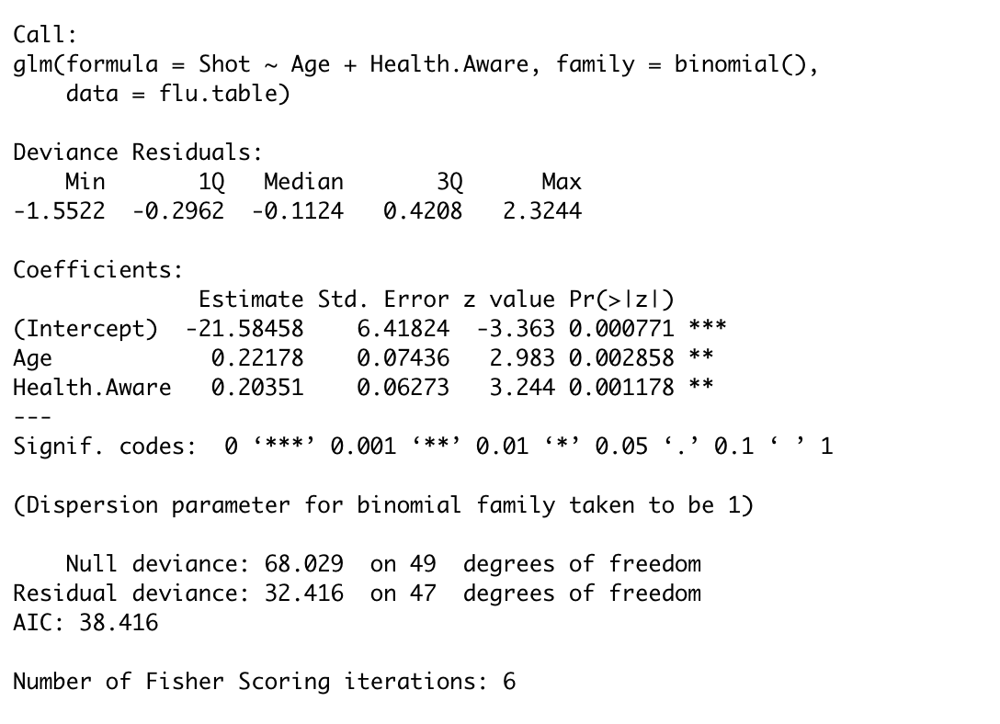
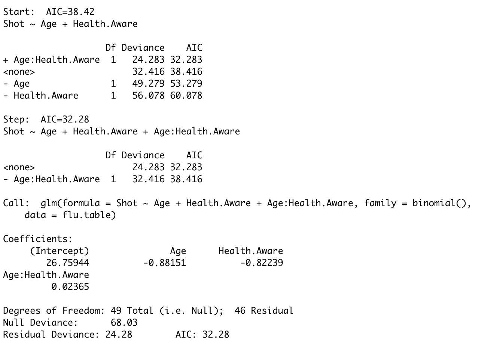
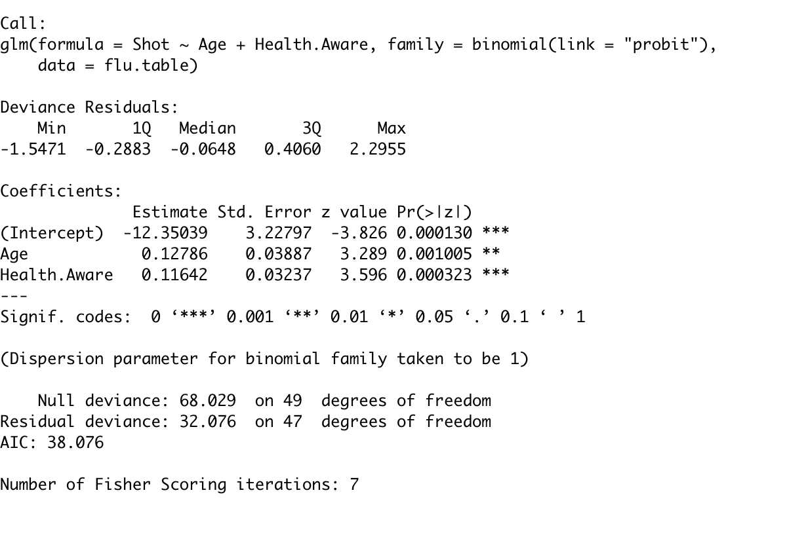

```{r setup, include=FALSE}
knitr::opts_chunk$set(echo = TRUE, fig.width = 7, fig.height = 4, message=FALSE, warning=FALSE, cache = TRUE)
set.seed(0)
library(ggplot2)
library(magrittr)
library(dplyr)
```


## Recap

- What is a regression model?
- Descriptive statistics -- graphical
- Descriptive statistics -- numerical
- Inference about a population mean
- Difference between two population means
- Some tips on R
- Simple linear regression (covariance, correlation, estimation, geometry of least squares)
    - Inference on simple linear regression model
    - Goodness of fit of regression: analysis of variance.
    - $F$-statistics.
    - Residuals.
    - Diagnostic plots for simple linear regression (graphical methods).

## Recap
- Multiple linear regression
    - Specifying the model.
    - Fitting the model: least squares.
    - Interpretation of the coefficients.
    - Matrix formulation of multiple linear regression
    - Inference for multiple linear regression
        - $T$-statistics revisited.
        - More $F$ statistics.
        - Tests involving more than one $\beta$.   
- Diagnostics – more on graphical methods and numerical methods
    - Different types of residuals
    - Influence
    - Outlier detection
    - Multiple comparison (Bonferroni correction)
    - Residual plots:
        - partial regression (added variable) plot,
        - partial residual (residual plus component) plot.

## Recap
- Adding qualitative predictors 
    - Qualitative variables as predictors to the regression model.
    - Adding interactions to the linear regression model. 
    - Testing for equality of regression relationship in various subsets of a population
- ANOVA
    - All qualitative predictors.
    - One-way layout
    - Two-way layout
- Transformation
    - Achieving linearity
    - Stabilize variance
    - Weighted least squares
- Correlated Errors
    - Generalized least squares
- Bootstrapping linear regression
- Selection

## Recap
- Colliniarity
  - Bias-variance tradeoff
  - Penalized Regression
    - Ridge
    - LASSO
    - Elastic net

## Outline (Logistic regression)
- Most models so far have had response $Y$ as continuous.
- Binary outcomes
    - Many responses in practice fall into the $YES/NO$ framework.
    - Examples:
      1. medical: presence or absence of cancer
      2. financial: bankrupt or solvent
      3. industrial: passes a quality control test or not

## Modelling probabilities

- For $0-1$ responses we need to model 
$$\pi(x_1, \dots, x_p) = P(Y=1|X_1=x_1,\dots, X_p=x_p)$$
- That is, $Y$ is Bernoulli with a probability that depends on covariates $\{X_1, \dots, X_p\}.$
- **Note:** $\text{Var}(Y) = \pi ( 1 - \pi) = E(Y) \cdot ( 1-  E(Y))$
- **Or,** the binary nature forces a relation between mean and variance of $Y$.
- This makes logistic regression a `Generalized Linear Model`.

    
## Flu shot example

- A local health clinic sent fliers to its clients to encourage everyone, but especially older persons at high risk of complications, to get a flu shot in time for protection against an expected flu epidemic.
- In a pilot follow-up study, 50 clients were randomly selected and asked whether they actually received a flu shot. $Y={\tt Shot}$
- In addition, data were collected on their age $X_1={\tt Age}$ and their health awareness $X_2={\tt Health.Aware}$


## A possible model

- Simplest model $\pi(X_1,X_2) = \beta_0 + \beta_1 X_1 + \beta_2 X_2$
- Problems / issues:
     - We must have $0 \leq E(Y) = \pi(X_1,X_2) \leq 1$. OLS will not force this.
     - Ordinary least squares will not work because of relation between mean and variance.

## Logistic model

- Logistic model $\pi(X_1,X_2) = \frac{\exp(\beta_0 + \beta_1 X_1 + \beta_2 X_2)}{1 + \exp(\beta_0 + \beta_1 X_1 + \beta_2 X_2)}$
- This automatically fixes $0 \leq E(Y) = \pi(X_1,X_2) \leq 1$.
- **Define:** $\text{logit}(\pi(X_1, X_2)) = \log\left(\frac{\pi(X_1, X_2)}{1 - \pi(X_1,X_2)}\right) = \beta_0 + \beta_1 X_1 + \beta_2 X_2$

## Logistic distribution

```{r}
logit.inv = function(x) {
  return(exp(x) / (1 + exp(x)))
}
x = seq(-4, 4, length=200)
plot(x, logit.inv(x), lwd=2, type='l', 
     col='red', cex.lab=1.2)
```


## Logistic transform: `logit`

```{r}
logit = function(p) {
  return(log(p / (1 - p)))
}
p = seq(0.01, 0.99,length=200)
plot(p, logit(p), lwd=2, type='l', 
     col='red', cex.lab=1.2)
```


## Binary regression models

- Models $E(Y)$ as  $F(\beta_0 + \beta_1 X_1 + \beta_2 X_2)$ for some increasing function $F$ (usually a distribution function).
- The logistic model uses the function (we called `logit.inv` above) $$F(x)=\frac{e^x}{1+e^x}.$$
- Can be fit using Maximum Likelihood / Iteratively Reweighted Least Squares.
- For logistic regression, coefficients have nice interpretation in terms of `odds ratios` (to be defined shortly).
- What about inference?

## Criterion used to fit model

- Instead of sum of squares, logistic regression 
uses *deviance*:
- Let $L$ be the likelihood function.
- $DEV(\mu| Y) = -2 \log L(\mu| Y) + 2 \log L(Y| Y)$ where $\mu$ is a location estimator for $Y$.
    - $L(Y| Y) = 1$
    - deviance is always larger or equal than zero
    - deviance is zero only if the fit is perfect
- If $Y$ is Gaussian with independent $N(\mu_i,\sigma^2)$ entries then $DEV(\mu| Y) = \frac{1}{\sigma^2}\sum_{i=1}^n(Y_i - \mu_i)^2$
- If $Y$ is a binary vector, with mean vector $\pi$ then 
$DEV(\pi| Y) = -2 \sum_{i=1}^n \left( Y_i \log(\pi_i) + (1-Y_i) \log(1-\pi_i) \right)$

**Minimizing deviance $\iff$ Maximum Likelihood**

## Deviance for logistic regression

- For any binary regression model, $\pi=\pi(\beta)$.

- The deviance is:
$$\begin{aligned}
     DEV(\beta| Y) &=  -2 \sum_{i=1}^n \left( Y_i {\text{logit}}(\pi_i(\beta)) + \log(1-\pi_i(\beta)) \right)
     \end{aligned}$$
     
- For the logistic model, the RHS is:
$$\begin{aligned}
    -2 \left[ (X\beta)^Ty + \sum_{i=1}^n\log \left(1 + \exp \left(\sum_{j=1}^p X_{ij} \beta_j\right) \right)\right]
     \end{aligned}$$
   
- The logistic model is special in that $\text{logit}(\pi(\beta))=X\beta$. If we used
a different transformation, the first part would not be linear in $X\beta$.

- *For ease of notation, we assume that `X[,1]=1` corresponding to $\beta_0$*

## Flu shot example
- Response: Flu shot is taken or not.
- Predictors: Age, Health awareness
```{r}
flu.table = read.table('http://stats191.stanford.edu/data/flu.table',
                       header=TRUE)
head(flu.table)
```

```{r}
flu.glm = glm(Shot ~ Age + Health.Aware, 
              data=flu.table, 
              family=binomial())
```

## Flu shot example
```{r eval=FALSE, echo=FALSE}
summary(flu.glm)
```

```{r echo=FALSE,out.width = "200px"}

```

- null deviance: how well the reponse is predicted when there is no predictors
- residual deviance: how well the reponse is predicted when there predictors
- in this example, residual deviance is smaller than the null deviance.

## Odds Ratios

- One reason logistic models are popular is that the parameters have simple interpretations in terms of **odds**
   $$ODDS(A) = \frac{P(A)}{1-P(A)}.$$
- Logistic model: $$OR_{X_j} = \frac{ODDS(Y=1|\dots, X_j=x_j+h, \dots)}{ODDS(Y=1|\dots, X_j=x_j, \dots)} = e^{h \beta_j}$$
- If $X_j \in {0, 1}$ is dichotomous, then odds for group with $X_j = 1$ are $e^{\beta_j}$ higher, other parameters being equal.

##  Rare disease hypothesis

- When incidence is rare, $P(Y=0)\approxeq 1$ no matter what the covariates $X_j$’s are.
- In this case, odds ratios are almost ratios of probabilities: $$OR_{X_j} \approxeq \frac{{\mathbb{P}}(Y=1|\dots, X_j=x_j+1, \dots)}{{\mathbb{P}}(Y=1|\dots, X_j=x_j, \dots)}$$
- Hypothetical example: in a lung cancer study, if $X_j$ is an indicator of smoking or not, a $\beta_j$ of 5 means for smoking vs. non-smoking, smokers are $e^5 \approx 150$ times more likely to develop lung cancer


##  Flu shot example

- In flu example, the odds ratio for a 45 year old with health awareness 50 compared to a 35 year old with the same health awareness are $$e^{-1.429284+3.647052}=9.18$$

```{r}
logodds = predict(flu.glm, 
                  list(Age=c(35,45),Health.Aware=c(50,50)),
                  type='link')
logodds

OR = exp(logodds[2])/exp(logodds[1]); OR
```

##  Flu shot example

- The estimated probabilities are below, yielding a ratio of $0.1932/0.0254 \approx 7.61$. Not too far from 9.18.

```{r}
prob = exp(logodds)/(1+exp(logodds))
prob
prob[2] / prob[1]
```

# Iteratively reweighted least squares

## An algorithm to fit the model

1. Initialize $\widehat{\pi}_i = \bar{Y}, 1 \leq i \leq n$
2. Define $$Z_i = g(\widehat{\pi}_i) + g'(\widehat{\pi}_i) (Y_i - \widehat{\pi_i}),$$ where $g$ is the logit function.
3. Fit weighted least squares model 
$$Z_i \sim \sum_{j=1}^p \beta_j X_{ij}, \qquad w_i = \widehat{\pi_i} (1 - \widehat{\pi}_i)$$
4. Set $\widehat{\pi}_i = \text{logit}^{-1} \left(\widehat{\beta}_0 + \sum_{j=1}^p \widehat{\beta}_j X_{ij}\right)$.
5. Repeat steps 2-4 until convergence.

## Newton-Raphson

- The Newton-Raphson updates for logistic regression are (minimizing Deviance)
$$
\hat{\beta} \mapsto \hat{\beta} - \nabla^2 DEV(\hat{\beta})^{-1} \nabla DEV(\hat{\beta})
$$

- These turn out to be the same as the updates above (as in the Iteratively reweighted least squares).

- In earlier statistical software one might only have access to a weighted least squares estimator.

## Inference

- One thing the IRLS procedure hints at is what the approximate
limiting distribution is.
    - The IRLS procedure suggests using approximation $\widehat{\beta} \approx N(\beta, (X^TWX)^{-1})$
    - This allows us to construct CIs, test linear hypotheses, etc.
    - Intervals formed this way are called *Wald intervals*.

## Flu shot example

- 95\% CI for $\beta_{1}$
```{r}
center = coef(flu.glm)['Age']
SE = sqrt(vcov(flu.glm)['Age', 'Age'])
U = center + SE * qnorm(0.975)
L = center - SE * qnorm(0.975)
data.frame(L, center, U)
```

## Covariance

- The estimated covariance `vcov(flu.glm)` uses the weights computed from the fitted model.
```{r}
pi.hat = fitted(flu.glm)
W.hat = pi.hat * (1 - pi.hat)
X = model.matrix(flu.glm)
C = solve(t(X) %*% (W.hat * X))
c(SE, sqrt(C['Age', 'Age']))
```


## Confidence intervals in `R`

- The intervals above are slightly different from what `R` will give you if you ask it for  confidence intervals.
- `R` uses so-called profile intervals. 
- For large samples the two methods should agree quite closely.


## Confidence intervals in `R`
```{r}
CI = confint(flu.glm)
CI
# profile intervals are not symmetric around the estimate...
mean(CI[2,]) 
# we computed center of the interval as follows
data.frame(L, center, U)
```


## Testing in logistic regression

What about comparing full and reduced model?

- For a model ${\cal M}$, $DEV({\cal M})$ replaces $SSE({\cal M})$.
- In least squares regression (with $\sigma^2$ known), we use 
$$\frac{1}{\sigma^2}\left( SSE({\cal M}_R) - SSE({\cal M}_F) \right) \overset{H_0:{\cal M}_R}{\sim} \chi^2_{df_R-df_F}$$
- This is closely related to $F$ with large $df_F$: approximately $F_{df_R-df_F, df_R} \cdot (df_R-df_F)$.

- For logistic regression this difference in $SSE$ is replaced with  $$DEV({\cal M}_R) - DEV({\cal M}_F) \overset{n \rightarrow \infty, H_0:{\cal M}_R}{\sim} \chi^2_{df_R-df_F}$$
- Resulting tests do not agree numerically with those coming from IRLS (Wald tests). Both are often used.

## Flu shot example
```{r}
anova(glm(Shot ~ 1,
          data=flu.table, 
          family=binomial()), 
      flu.glm)
```

## Flu shot example
```{r}
anova(glm(Shot ~ Health.Aware,
          data=flu.table, 
          family=binomial()), 
      flu.glm)
```

## Flu shot example
- We should compare this difference in deviance with a $\chi^2_1$ random variable.

```{r}
# testing ~1 vs ~1 + Health.Aware + Age
1 - pchisq(35.61, 2) 
# testing ~ 1 + Health.Aware vs ~1 + Health.Aware + Age
1 - pchisq(16.863, 1) 
```

##
- Let's compare this with the Wald test:
```{r eval=FALSE}
summary(flu.glm)
```

```{r echo=FALSE,out.width = "200px"}

```

## Diagnostics

- Similar to least square regression, only residuals used are usually *deviance residuals*
   $r_i = \text{sign}(Y_i-\widehat{\pi}_i) \sqrt{DEV(\widehat{\pi}_i|Y_i)}.$
   
- These agree with usual residual for least square regression.

## Diagnostics
```{r echo=FALSE}
par(mfrow=c(2,2))
plot(flu.glm)
```

## Diagnostics
```{r eval=FALSE}
influence.measures(flu.glm)
```

```{r echo=FALSE,out.width = "300px"}
knitr::include_graphics("Lecture_29_flu_shot_influence_measure.png")
```

## Model selection

- As the model is a likelihood based model, each fitted model has an AIC.
- Stepwise selection can be used easily

## Model selection
```{r eval=FALSE}
step(flu.glm, scope=list(upper= ~.^2), 
     direction='both')
```

```{r echo=FALSE,out.width = "200px"}

```


# Penalized regression

## LASSO
- Instead of just minimizing deviance, we can also look at penalized versions
$$
\text{minimize}_{\beta} \frac{1}{2n} DEV(\beta) + \lambda \|\beta\|_1
$$

## Flu shot example
```{r}
library(glmnet)
X = model.matrix(flu.glm)[,-1]
Y = as.numeric(flu.table$Shot)
G = glmnet(X, Y, family="binomial")
plot(G)
```

## Spam data set
- A data frame with 4601 observations on the 57 numeric predictor variables and a response `spam` is factor variable with 2 levels `email`, `spam`.
- More information of the data is [here](https://archive.ics.uci.edu/ml/datasets/spambase).
```{r}
library(ElemStatLearn)
data(spam)
dim(spam)
X = model.matrix(spam ~ ., data=spam)[,-1]
Y = as.numeric(spam$spam == 'spam')
```

## Spam data set
```{r}
G = glmnet(X, Y, family='binomial')
plot(G)
```

## Spam data set
```{r}
CV = cv.glmnet(X, Y, family='binomial')
plot(CV)
c(CV$lambda.min, CV$lambda.1se)
```

## Extracting coefficients from `glmnet`

```{r}
beta.hat = coef(G, s=CV$lambda.1se)
beta.hat
```

# Probit model

## Probit model

- Probit regression model: $$\Phi^{-1}(E(Y|X))= \sum_{j=1}^{p} \beta_j X_{j}$$ where $\Phi$ is CDF of $N(0,1)$, i.e. $\Phi(t) = {\tt pnorm(t)}$, $\Phi^{-1}(q) = {\tt qnorm}(q)$.

- Regression function
$$
\begin{aligned}
E(Y|X) &= E(Y|X_1,\dots,X_p) \\
&= P(Y=1|X_1, \dots, X_p) \\
& = {\tt pnorm}\left(\sum_{j=1}^p \beta_j X_j \right)\\
\end{aligned}
$$

- In logit, probit and cloglog ${\text{Var}}(Y_i)=\pi_i(1-\pi_i)$ but the model for the mean is different.

- Coefficients no longer have an odds ratio interpretation.

## Probit model
```{r eval=FALSE}
summary(glm(Shot ~ Age + Health.Aware, 
            data=flu.table, 
            family=binomial(link='probit')))
```

```{r echo=FALSE,out.width = "250px"}

```


## Generalized linear models

Given a dataset $(Y_i, X_{i1}, \dots, X_{ip}), 1 \leq i \leq n$ we consider a model for the distribution of $Y|X_1, \dots, X_p$.

- If $\eta_i=g(E(Y_i|X_i)) = g(\mu_i) =  \sum_{j=1}^p \beta_j X_{ij}$ then $g$ is called the *link*
   function for the model.
- If ${\text{Var}}(Y_i) = \phi \cdot V({\mathbb{E}}(Y_i)) = \phi \cdot V(\mu_i)$ for $\phi > 0$ and some function $V$, then $V$ is the called *variance* function for the model.
- Canonical reference [\blc Generalized linear models\bc](http://www.amazon.com/Generalized-Edition-Monographs-Statistics-Probability/dp/0412317605).

## Binary regression as GLM

- For a logistic model, $g(\mu)={\text{logit}}(\mu), \qquad V(\mu)=\mu(1-\mu).$
- For a probit model, $g(\mu)=\Phi^{-1}(\mu), \qquad V(\mu)=\mu(1-\mu).$
- For a cloglog model, $g(\mu)=-\log(-\log(\mu)), \qquad V(\mu)=\mu(1-\mu).$
- All of these have *dispersion* $\phi=1$.

## Reference
- **CH** Chapter 12.
- Lecture notes of  [\blc Jonathan Taylor \bc](http://statweb.stanford.edu/~jtaylo/).