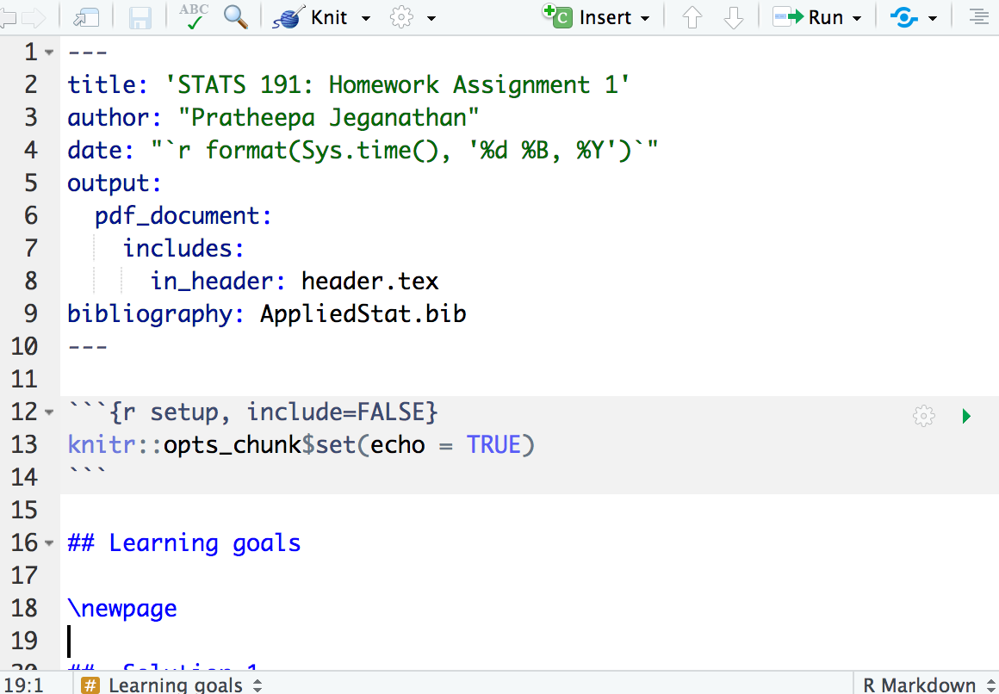

```{r setup, include=FALSE}
knitr::opts_chunk$set(echo = TRUE, fig.width = 5, fig.height = 3, message=FALSE, warning=FALSE, cache = TRUE)
set.seed(0)
```

 

## Recall

- What is a regression model?

- Descriptive statistics -- graphical

- Descriptive statistics -- numerical

- Inference about a population mean

- Difference between two population means

# Today (Some tips on R)


##  Introduction to R 

We will use R and R Markdown for this course (highly recommended). The examples in the lecture notes and homework assignments will be written in R. Choosing R for your homework solutions and project is highly recommended. 

- Follow this [\blc https://www.r-project.org/\bc](https://www.r-project.org/) to install R:
    - R is an interpreted language, which means you will not have to compile your code and your actual code will be executed.
    - R is interactive for data analysis.
    - R includes interfaces to other programming languages (Python, Julia, C++), which means you can adapt R to big data analysis or computationally intensive procedures [@chambers2017].
    - Read more about R: [\blc https://www.r-project.org/about.html\bc](https://www.r-project.org/about.html).

##  Introduction to R Markdown 

- Follow this [\blc https://www.rstudio.com/\bc](https://www.rstudio.com/) to install R Studio (The newest version of R Studio is highly recommended (v1.1.463)): we will use R Markdown from R Studio to
    - track data analysis. 
    - produce high-quality documents that can be shared with your collaborators.
    - reproduce the results.
    - Read more about R Markdown: [\blc here\bc](https://rmarkdown.rstudio.com/index.html).
    
## Introduction to Latex 

- Latex, which will enable you to create PDFs directly from the R Markdown in RStudio.

```{r eval=FALSE}
install.packages("tinytex")
```
- After installing [\blc TinyTex\bc](https://yihui.name/tinytex/), close RStudio.
- Reopen RStudio.
- Run the following:
```{r eval=FALSE}
tinytex::install_tinytex()
```


# Basics of R and R Markdown

##  Vectors

These examples follow Kloke and McKean (2015): Nonparametric Statistical Methods Using R. Chapter 1 [@kloke2014].

## Matrices and data frames

Make vectors:

```{r}
x = c(11,218,123,36,1001)
y = rep(1,5)
z = seq(1,5,by =1)
```

Vector operations:
```{r}
y + z

u = y + z # comments: assign the value to variable u
u
```

##

- Some more operations
```{r}
sum(x)

c(mean(x),sd(x),var(x),median(x))

length(x)
```

- \rc A word of caution.\bc In `R` you can overwrite built-in functions so try not to call variables `c`.

- Other variables to be careful are the aliases `T` for `TRUE` and `F` for `FALSE`. Since we compute $t$ and $F$ statistics it is natural to also have variables named `T` so when you are expecting `T` to be `TRUE` you might get a surprise.


##  Generate a random sample

Ex: coin tossing

```{r}
coin = c("H", "T")
set.seed(100)
samples = sample(x= coin, size =100, 
  replace = TRUE)
```

the number times _H_ shows up
```{r}
sum(samples == "H")
```


##  Matrices

combine vectors of same data type into matrices
```{r}
X = cbind(x,y,z)
X
```

##
create a matrix using R function from the base package

```{r}
Y = matrix(data = c(2,3,4,5,6,7), 
  nrow = 2, ncol =3, byrow = TRUE)
Y
```

##  Data frame
combine vectors of different data types
```{r}
subjects = c('Jim','Jack','Joe','Mary','Jean')
score = c(85,90,75,100,70)
D = data.frame(subjects = subjects, score = score)
D
```

##

```{r}
D$class = c("Jun", "Sopho","Sopho", "Sopho", "Jun")
D
```

##  Generating random variables

R provides numerous functions for random number generation

Ex: generate standard normal random variable
```{r}
z = rnorm(n = 100, mean = 0, sd = 1)
```

```{r}
summary(z)
```

## Graphics
Basic plotting Ex: histogram of $Z$

```{r }
hist(z,breaks = 30)
```

##  Sophisticated plots

The ggplot2 package is very popular to make more sophisticated plots

```{r}
library(ggplot2)
```

You are encouraged to learn the grammar of ggplot. There are many tutorials online. Here is one example [\blc link\bc](http://www.cookbook-r.com/Graphs/).

##  

Let's see how to use ggplot2 for scatter plots on automobile data 
```{r message=FALSE,warning=FALSE}
data(mtcars)
p = ggplot(mtcars, aes(x=wt,y=mpg)) + 
  geom_point(position=position_jitter(w=0.1,h=0)) +
  geom_smooth() + xlab('Weight (1000 lbs)') + 
  ylab("Miles/(US) gallon")

```

##
```{r message=FALSE,warning=FALSE, echo=FALSE}
p
```

##
```{r}
ggsave("example_plot.eps", p, width = 6, height = 5)
```

- Add an external image and write a caption
```{r out.width="50%", fig.cap="External image"}
knitr::include_graphics("example_plot.eps")
```

##  Repeating tasks

- In addition to `for` loop, R provides `apply` and `tapply` functions to replicate code a number of times
```{r}
X
```
- row-wise mean 
```{r}
apply(X,1,mean)
```

##

- column-wise mean
```{r}
apply(X,2,mean)
```

```{r}
D
tapply(D$score,D$class,mean)
```

##  User defined functions

```{r}
mSummary = function(x) {
  q1 = quantile(x,.25)
  q3 = quantile(x,.75) 
  lt = list(med=median(x),iqr=q3-q1)
  return(lt)
}
xsamp = 1:13
mSummary(xsamp)
```

##
- Read data set from the website
```{r}
readCSVFromCANVAS = function(url, sep = "\t"){
  read.table(url, header = T, sep = sep)
}

groundhog  = readCSVFromCANVAS("http://web.stanford.edu/class/stats191/data/groundhog.table", sep = ",")
head(groundhog)
```


##  Monte Carlo simulations

Generate a data set with 100 rows and 10 columns. Each row is from a standard normal distribution. 

```{r}
set.seed(1000)
X = matrix(rnorm(10*100),ncol=10)
```

Sample mean of each of the 100 samples:
```{r}
xbar = apply(X, MARGIN = 1, FUN = mean)
```

Variance of sample mean:
```{r}
var(xbar)
```

compared to theoretical results: $\frac{\sigma^2}{n}$
```{r}
1/10
```

##  R packages

Two distribution site: CRAN and Bioconductor

In addition to commonly used functions in R, some other functions are available from developers. 

For example, to use functions in `dplyr` package, we need to install the package.

```{r message=FALSE, warning=FALSE, eval=FALSE}
install.packages("dplyr")
```

```{r}
library(dplyr)
head(iris)
dplyr::filter(iris, Species== "setosa")
```

## Distributions in R
- In practice, we will often be using the distribution (CDF), quantile (inverse CDF) of standard random variables like the *T*, *F*, chi-squared and normal.

- The standard 1.96 (about 2) standard deviation rule for $\alpha=0.05$:(note that 1-0.05/2=0.975)

```{r}
qnorm(0.975)
```

##
- We might want the $\alpha=0.05$ upper quantile for an F with 2,40 degrees of freedom:
```{R}
qf(0.95, 2, 40)
```

- So, any observed F greater than 3.23 will get rejected at the $\alpha=0.05$ level.

##
- Alternatively, we might have observed an $F$ of 5 with
2, 40 degrees of freedom, and want the p-value


```{R}
1 - pf(5, 2, 40)
```

##
- Let's compare this p-value with a chi-squared with 2 degrees of freedom, which is like an $F$ with infinite degrees of freedom in the denominator (send 40 to infinity).
- We also should multiply the 5 by 2 because it's divided by 2 (numerator degrees of freedom) in the $F$.

```{R}
c(1 - pchisq(5*2, 2), 1 - pf(5, 2, 4000))
```

Other common distributions used in applied statistics are `norm` and `t`.

# Templates 

##  Homework template

- See the homework template in [\blc Canvas/Files/Templates\bc](https://canvas.stanford.edu/courses/108253/files/folder/Templates).
    
- More templates:
    - You will have access to R markdown files for making lecture slides and homework assignments.

- See the following [\blc link\bc](http://www.stat.cmu.edu/~cshalizi/rmarkdown/) for a further outline of using R markdown for reporting.

##




## Other references

- [\blc An Introduction to R\bc](http://cran.r-project.org/doc/manuals/R-intro.pdf)
  
- [\blc R for Beginners\bc](http://cran.r-project.org/doc/contrib/Paradis-rdebuts_en.pdf)

- [\blc Modern Applied Statistics with S\bc](http://www.stats.ox.ac.uk/pub/MASS4/)

- [\blc Practical ANOVA and Regression in R\bc](http://cran.r-project.org/doc/contrib/Faraway-PRA.pdf)

- [\blc simpleR\bc](http://cran.r-project.org/doc/contrib/Verzani-SimpleR.pdf)

- [\blc R Reference Card\bc](http://cran.r-project.org/doc/contrib/Short-refcard.pdf)

- [\blc R Manuals\bc](http://cran.r-project.org/manuals.html)

- [\blc R Wiki\bc](http://wiki.r-project.org/)

- [\blc Modern Statistics for Modern Biology\bc](http://web.stanford.edu/class/bios221/book/)

- [\blc R Studio Education\bc](https://education.rstudio.com/)

## References for this lecture

- Based on the lecture notes of  [\blc Jonathan Taylor \bc](http://statweb.stanford.edu/~jtaylo/).


