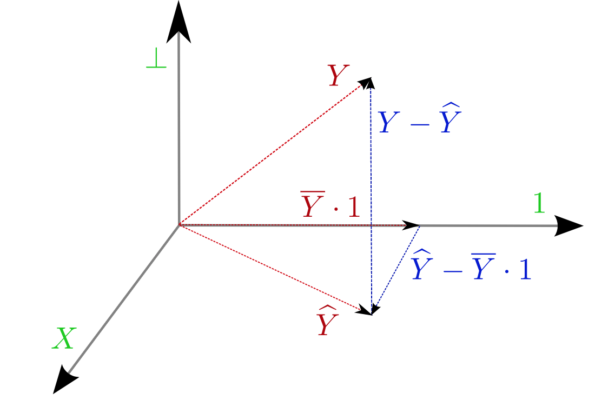

```{r setup, include=FALSE}
knitr::opts_chunk$set(echo = TRUE, fig.width = 5, fig.height = 3, message=FALSE, warning=FALSE, cache = TRUE)
set.seed(0)
```

# Recall

##

- What is a regression model?

- Descriptive statistics -- graphical

- Descriptive statistics -- numerical

- Inference about a population mean

- Difference between two population means

- Some tips on R

## Outline
- Correlation
- Introduction to simple linear regression
- Loss functions
- Estimation
- Example

# Simple linear regression

##

- The first type of model, which we will spend a lot of time on, is the *simple linear regression model*. 
- One simple way to think of it is via scatter plots. 
- Below are heights of mothers and daughters collected by Karl Pearson in the late 19th century. 


## Scatter plot
```{r}
library(alr4)
data(Heights)
M = Heights$mheight
D = Heights$dheight
library(ggplot2)
heights_fig = ggplot(Heights, 
  aes(mheight, dheight)) + 
  geom_point() + theme_bw()
```

##
```{r echo=FALSE}
heights_fig
```

# Covariance and Correlation

## Covariance

- Consider random pairs $\left(X, Y\right)$. The strength of the relationship or association between $X$ and $Y$ is of our main interest.
- If $X$ and $Y$ are continuous, the direction of the linear relationship between $X$ and $Y$ can be measured by **covariance**.
$$\text{Cov}\left(X, Y\right) = \E \left(X-\mu_{X} \right)\left(Y-\mu_{Y} \right)$$.
- Given a random sample $\left(X_{1}, Y_{1}\right), \cdots, \left(X_{n}, Y_{n}\right)$, the estimator of $\text{Cov}\left(X, Y\right)$ is a sample covariance.
$$\hat{\text{Cov}}\left(X, Y\right) = \dfrac{\sum_{i=1}^{n}\left(X_{i} - \bar{X}\right)\left(Y_{i} - \bar{Y}\right)}{n-1}$$


## Correlation coefficient

- If $X$ and $Y$ are continuous, from random sample $\left(X_{1}, Y_{1}\right), \cdots, \left(X_{n}, Y_{n}\right)$ we can use Pearson correlation coefficient or nonparametric Kendall or Spearman statistics to measure the direction and strength of a linear relationship.
- Let $X$ and $Y$ be continuous random variables with mean $\mu_{X}$, $\mu_{Y}$ and standard deviation $\sigma_{X}$, $\sigma_{Y}$.
- Correlation coefficient is 
$$\rho = \dfrac{\E \left(X-\mu_{X} \right)\left(Y-\mu_{Y} \right)}{\sigma_{X}\sigma_{Y}} = \dfrac{\E \left(XY \right)- \E \left(X\right)\E \left(Y\right)}{\sigma_{X}\sigma_{Y}}.$$
- If $X$ and $Y$ are independent, $\E \left(XY \right) = \E \left(X\right)\E \left(Y\right)$. Thus, $\rho = 0$, converse is not true.
    - If $X$ and $Y$ are bivariate normal, converse is also true.
- If $X$ and $Y$ are dependent, $\rho \neq 0$.
- Pearson correlation coefficient measures the linear association between $X$ and $Y$. 


##  Pearson's correlation coefficient

- Sample Pearson's correlation coefficient:

$$\hat{\rho}=r = \dfrac{\sum_{i=1}^{n}\left(X_{i} - \bar{X}\right)\left(Y_{i} - \bar{Y}\right)}{\sqrt{\sum_{i=1}^{n}\left(X_{i} - \bar{X}\right)^{2}\sum_{i=1}^{n}\left(Y_{i} - \bar{Y}\right)^{2}}}.$$


##
- Compute the Pearson's correlations coefficient of heights data
```{r}
cor(D, M, method = "pearson")
```
- Examine the scatter plot.
- Interpret $\hat{\rho}$.
- $\hat{\rho}$ cannot be used for prediction purposes.

## Regression

- Ignore mother's height and guessing the daughter's height, we would guess the average height of daughters

```{r}
mean(D)
```

- Can we do better?

##

- A simple linear regression model fits a line through the above scatter plot in a particular way. 
- Specifically, it tries to estimate the height of a new daughter in this population, say $D_{new}$, whose mother had height $M_{new}$. 
- It does this by considering each slice of the data. 
- Here is a slice of the data near $M = 66$, the slice is taken over a window of size 1 inch.

##
```{r echo=FALSE}
X = 66
rect = data.frame(xmin = X-.5, xmax = X+.5, 
  ymin=-Inf, ymax=Inf)
heights_fig + 
  geom_rect(data=rect, 
    aes(xmin = xmin, xmax = xmax, 
      ymin = ymin, ymax =ymax), color="grey20",
    alpha=0.5,
    inherit.aes = FALSE) +
  geom_vline(xintercept = X, color = "red")
```

##
```{R}
selected_points = (M <= X+.5) & (M >= X-.5)
mean_within_slice = mean(D[selected_points])
mean_within_slice
```

- We see that, in our sample, the average height of daughters whose height fell within our slice is about 65.2 inches. 

##
- Of course this height varies by slice. For instance, at 60 inches:

```{r}
X = 60
selected_points = (M <= X+.5) & (M >= X-.5)
mean_within_slice = mean(D[selected_points])
mean_within_slice
```

##
```{r echo=FALSE}
X = 60
rect = data.frame(xmin=X-.5, xmax=X+.5, 
  ymin=-Inf, ymax=Inf)
heights_fig + 
  geom_rect(data=rect, 
    aes(xmin=xmin, xmax=xmax, ymin=ymin, ymax=ymax), color="grey20", alpha=0.5, inherit.aes = FALSE) +
  geom_vline(xintercept = X, color = "red")
```


##
- The regression model puts a line through this scatter plot in an *optimal* fashion.

- To do this, simple linear regression assumes that the mean in slice $M$ lies on some line

$$\beta_0+\beta_1 M.$$

- It then chooses $(\beta_0, \beta_1)$ based on the data.

##
```{r}
parameters.est = lm(D ~ M)$coef
print(parameters.est)
intercept = parameters.est[1]; intercept
slope = parameters.est[2]; slope
```

##
```{r echo=FALSE}
heights_fig + 
  geom_abline(slope = slope, 
    intercept = intercept, 
    color='red', size=1) 

```


## Mathematical formulation

For height of couples data: a mathematical model:
$${\tt Daughter} = f({\tt Mother}) + \varepsilon,$$
where $f$ gives the average height of the daughter of a mother of height Mother and $\varepsilon$ is the random variation within the slice.

## Linear regression models

- A *linear* regression model says that the function $f$ is a sum (linear combination) of functions of ${\tt Mother}$.

- Simple linear regression model: 
$$f({\tt Mother}) = \beta_0 + \beta_1 \cdot {\tt Mother}$$
for some unknown parameter vector $(\beta_0, \beta_1)$.

- Could also be a sum (linear combination) of *fixed* functions of `Mother`:
$$f({\tt Mother}) = \beta_0 + \beta_1 \cdot {\tt Mother} + \beta_2 \cdot {\tt Mother}^2$$

## Simple linear regression model

- Let $Y_i$ be the height of the $i$-th daughter in the sample, $X_i$ be the height of the $i$-th mother.

- We have a sample of $\left(X_{1},Y_{1}\right), \cdots, \left(X_{n},Y_{n}\right)$.

- Model:
   $$Y_i = \underbrace{\beta_0 + \beta_1 X_i}_{\text{regression equation}} + \underbrace{\varepsilon_i}_{\text{error}},$$
where $\varepsilon_i$ are random error.
    - $\E \left[\epsilon_{i} \right] = 0$ and $\V \left[\epsilon_{i} \right] = \sigma^{2}$

- $\varepsilon_i \sim \text{N}\left(0, \sigma^2\right)$ specifies a *distribution* for the $Y$'s given the $X$'s. 
    - i.e. $Y_{i} \vert x_{i} \sim \text{N}\left(\beta_0 + \beta_1 X_i, \sigma^2\right)$ is a *statistical model*..

## Fitting the model

- We will be using *least squares* regression. 
    - This measures the *goodness of fit* of a line by the sum of squared errors, $\text{SSE}$.
   
- Least squares regression chooses the line that minimizes
   $$\text{SSE}(\beta_0, \beta_1) = \sum_{i=1}^n (Y_i - \beta_0 - \beta_1 \cdot X_i)^2.$$

- In principle, we might measure goodness of fit differently by sum of absolute deviation ($\text{SAD}$): 
   $$\text{SAD}(\beta_0, \beta_1) = \sum_{i=1}^n |Y_i - \beta_0 - \beta_1 \cdot X_i|.$$
   
- For some *loss function* $L$ we might try to minimize
$$L(\beta_0,\beta_1) = \sum_{i=1}^n L(Y_i-\beta_0-\beta_1X_i).$$
   
## Why least squares?

- With least squares, the minimizers have explicit formula 
    - not so important with today's computer power -- especially when $L$ is convex.

- Resulting formula are *linear* in the outcome $Y$. This is important for inferential reasons. 
    - For only predictive power, this is also not so important.
   
- If assumptions are correct, then this is *maximum likelihood estimation*.

- Statistical theory tells us the *maximum likelihood estimators (MLEs)* are generally good estimators (consistency, asymptotic normality).

## Choice of loss function

- The choice of the function we use to measure goodness of fit, or the *loss* function, has an outcome on what
sort of estimates we get out of our procedure. 
- For instance, if, instead of fitting a line to a scatter plot, we were estimating a *center* of a distribution, which we denote by $\mu$, then we might consider minimizing several loss functions.

##

- If we choose the sum of squared errors:
$$\text{SSE}(\mu) = \sum_{i=1}^n (Y_i - \mu)^2.$$
    - Then, we know that the minimizer of $\text{SSE}(\mu)$ is the sample mean of $Y$.

- On the other hand, if we choose the sum of the absolute errors
 $$SAD(\mu) = \sum_{i=1}^n |Y_i - \mu|.$$
    - Then, the resulting minimizer is the sample median of $Y$.

##   
- Both of these minimization problems also have *population* versions as well. 
- For instance, the population mean minimizes, as a function of $\mu$
$$
\mathbb{E}((Y-\mu)^2)
$$
while the population median minimizes
$$
\mathbb{E}(|Y-\mu|).
$$


## Visualizing the loss function

Let's take a random scatter plot of $X$ and $Y$ and view the loss function $L\left( \beta_{0}, \beta_{1}\right)$.

```{r}
X = rnorm(50)
Y = 1.5 + 0.1 * X + rnorm(50) * 2
parameters.est = lm(Y ~ X)$coef
intercept = parameters.est[1]
slope = parameters.est[2]
```

##
```{r echo=FALSE}
ggplot(data.frame(X, Y), aes(X, Y)) + 
  geom_point() + 
  geom_abline(slope=slope, intercept=intercept)
```

##

- Let's plot the *loss* as a function of the parameters. 
- Note that the *true* intercept is 1.5 while the *true* slope is 0.1.

```{r}
grid_intercept = seq(intercept - 5, 
  intercept + 5, length = 100)
grid_slope = seq(slope - 5, 
  slope + 5, length = 100)
loss_data = expand.grid(intercept_ = grid_intercept,
  slope_=grid_slope)

loss_data$squared_error = numeric(nrow(loss_data))
for (i in 1:nrow(loss_data)) {
    loss_data$squared_error[i] = 
      sum((Y - X * loss_data$slope_[i] -
          loss_data$intercept_[i])^2)
}

```


##
```{r echo=FALSE}
squared_error_fig = (ggplot(loss_data, 
  aes(intercept_, slope_, 
    fill = squared_error)) + 
    geom_raster() +
    scale_fill_gradientn(colours = c("gray", 
      "yellow", "blue"))) +
  xlab(bquote(beta[0])) +
  ylab(bquote(beta[1]))
squared_error_fig 
```

##
Let's contrast this with the sum of absolute errors.

```{r}
loss_data$absolute_error = numeric(nrow(loss_data))
for (i in 1:nrow(loss_data)) {
    loss_data$absolute_error[i] = 
      sum(abs(Y - X * loss_data$slope_[i] -
          loss_data$intercept_[i]))
}
absolute_error_fig = (ggplot(loss_data, 
  aes(intercept_, slope_, 
    fill = absolute_error)) + 
    geom_raster() + 
    scale_fill_gradientn(colours = c("gray", 
      "yellow", "blue")))
```

##
```{r echo=FALSE}
absolute_error_fig +
  xlab(bquote(beta[0])) +
  ylab(bquote(beta[1]))
```

## Geometry of least squares
- The following picture depicts the geometry involved in least squares regression.

```{r,out.width="50%", fig.cap="Source - Jonathan Taylor", echo=FALSE}

```


##

- It requires some imagination but the picture should be thought as representing vectors in $n$-dimensional space, l where $n$ is the number of points in the scatter plot. 
- In our height data, $n=1375$. The bottom two axes should be thought of as 2-dimensional, while the axis marked "$\perp$" should be thought of as $(n-2)$ dimensional, or, 1373 in this case.
```{r}
dim(Heights)
```

## Least squares estimators

- There are explicit formula for the least squares estimators, i.e. the minimizers of the error sum of squares.

- For the slope, $\hat{\beta}_1$, it can be shown that 
$$\widehat{\beta}_1 = \frac{\sum_{i=1}^n(X_i - \overline{X})(Y_i - \overline{Y}
)}{\sum_{i=1}^n (X_i-\overline{X})^2} = \frac{\widehat{Cov}(X,Y)}{\widehat{Var}(
X)}.$$

- Knowing the slope estimate, the intercept estimate can be found easily:
$$\widehat{\beta}_0 = \overline{Y} - \widehat{\beta}_1 \cdot \overline{X}.$$


## Important lengths

- We can describe an observation as $\underbrace{y_{i}}_{\text{Observed}} = \underbrace{\hat{y_{i}}}_{\text{Fit}} + \underbrace{\left(y_{i} - \hat{y_{i}}\right)}_{\text{Deviation from fit}}$.
- Subtract $\bar{y}$ from both sides $\underbrace{y_{i}- \bar{y}}_{\text{Deviation from mean}} = \underbrace{\hat{y_{i}}-\bar{y}}_{\text{Deviation due to fit}} + \underbrace{\left(y_{i} - \hat{y_{i}}\right)}_{\text{Residual}}$.

##
- The (squared) lengths of the vectors $\left(\vY - \hat{\vY}\right)$, $\left(\bar{\vY} - \hat{\vY}\right)$, $\left( \vY - \bar{\vY}\right)$ are important quantities in what follows.

$$
\begin{aligned}
   \text{SSE} &= \sum_{i=1}^n(Y_i - \widehat{Y}_i)^2 = \sum_{i=1}^n (Y_i - \widehat{\beta}_0 - \widehat{\beta}_1 X_i)^2 \\
   \text{SSR} &= \sum_{i=1}^n(\overline{Y} - \widehat{Y}_i)^2 = \sum_{i=1}^n (\overline{Y} - \widehat{\beta}_0 - \widehat{\beta}_1 X_i)^2 \\
   \text{SST} &= \sum_{i=1}^n(Y_i - \overline{Y})^2 = SSE + SSR \\
   R^2 &= \frac{SSR}{SST} = 1 - \frac{SSE}{SST} = \widehat{Cor}(\pmb{X},\pmb{Y})^2.
   \end{aligned}
$$

## Coefficient of determination

An important summary of the fit is the ratio
$$
R^2 = \frac{SSR}{SST} = 1 - \frac{SSE}{SST}
$$
which measures *how much variability in $Y$* is explained by $X$.


## Estimate of $\sigma^2$

- There is one final quantity needed to estimate all of our parameters in our (statistical) model. 
- This is $\sigma^2$, the variance of the random variation within each slice (the regression model assumes this variance is constant within each slice).
- The estimate most commonly used is
$$
\hat{\sigma}^2 = \frac{1}{n-2} \sum_{i=1}^n (Y_i - \hat{\beta}_0 - \hat{\beta}_1 X_i)^2 = \frac{\text{SSE}}{n-2} = \text{MSE}
$$

##
- Above, note the practice of replacing the quantity $\text{SSE}(\hat{\beta}_0,\hat{\beta}_1)$, i.e. the minimum of this function, with just $\text{SSE}$.

- The term $\text{MSE}$ above refers to mean squared error: a sum of squares divided by what we call its *degrees of freedom*. 
    - The degrees of freedom of *SSE*, the *error sum of squares* is therefore $n-2$. 
    - Remember this $n-2$ corresponded to $\perp$ in the picture above.

##
- Using some statistical calculations that we will not dwell on, if our simple linear regression model is correct, then we can see that
$$
\frac{\hat{\sigma}^2}{\sigma^2} \sim \frac{\chi^2_{n-2}}{n-2}
$$
where the right hand side denotes a *chi-squared* distribution with $n-2$ degrees of freedom.

- (Note: our estimate of $\sigma^2$ *is not* the maximum likelihood estimate.)


## Example wages vs. education

- In this example, we'll look at the output of *lm* for the wage
data and verify that some of the equations we present for the 
least squares solutions agree with the output.
- The data was compiled from a study in econometrics [\blc Learning about Heterogeneity in Returns to Schooling\bc](https://onlinelibrary-wiley-com.stanford.idm.oclc.org/doi/epdf/10.1002/jae.744).

##
```{r}
url = 'http://www.stanford.edu/class/stats191/data/wage.csv'
wages = read.table(url, sep=',', 
  header=TRUE)
print(head(wages))
```


##
- Let's fit the linear regression model.

```{r}
wages.lm = lm(logwage ~ education, 
  data = wages)
print(wages.lm)
```

##

- As in the mother-daughter data, we might want to plot the data and add the regression line.

```{r, echo=FALSE}
logwage_fig = ggplot(wages, 
  aes(education, logwage)) +
  geom_point() + 
  theme_bw() +
  geom_abline(slope = wages.lm$coef[2],
    intercept=wages.lm$coef[1], 
    color='red', 
    size=1)
logwage_fig

```


## 
- Compute the least squares estimators $\hat{\beta}_{0}$ and $\hat{\beta}_{1}$ using the formula 
```{r}
beta.1.hat = cov(wages$education, 
  wages$logwage) / var(wages$education)
beta.0.hat = mean(wages$logwage) - 
  beta.1.hat * mean(wages$education)
```

- Compare the above with the `lm` output
```{r}
print(c(beta.0.hat, beta.1.hat))
print(coef(wages.lm))
```

## 
- Compute $\hat{\sigma}^{2}$ using the formula
```{r}
sigma.hat = sqrt(sum(resid(wages.lm)^2) / 
    wages.lm$df.resid)
c(sigma.hat, sqrt(sum((wages$logwage - 
    predict(wages.lm))^2) / wages.lm$df.resid))
```

- The summary from *R* also contains this estimate of $\sigma$: (Residual standard error)

##

```{r}
summary(wages.lm)
```

##  References for this lecture

- Based on the lecture notes of  [\blc Jonathan Taylor \bc](http://statweb.stanford.edu/~jtaylo/).

- Lecture notes of [\blc Stats 205\bc](https://pratheepaj.github.io/teaching/stats205/Lecture_13_Regression_problems.pdf)


